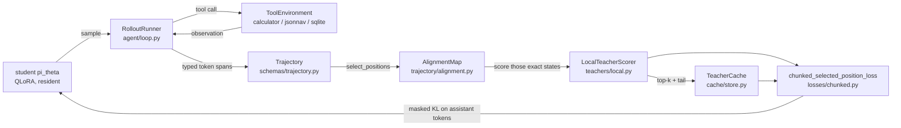

<p align="center">
  
</p>

<div align="center">

[](https://github.com/DaoyuanLi2816/mini-verl/actions/workflows/ci.yml)
[](https://github.com/DaoyuanLi2816/mini-verl/actions/workflows/build.yml)
[](https://pypi.org/project/miniverl/)
[](https://www.python.org)
[](https://github.com/DaoyuanLi2816/mini-verl/blob/main/LICENSE)

</div>

<p align="center">
  <a href="https://pypi.org/project/miniverl/"><strong>PyPI package</strong></a> ·
  <a href="#single-gpu-quickstart">Install &amp; train</a> ·
  <a href="https://github.com/DaoyuanLi2816/mini-verl/blob/main/docs/single-gpu-guide.md">Bring your own GPU</a> ·
  <a href="#recoverybench-do-fresh-on-policy-states-justify-their-cost">Measured result</a>
</p>

**The independent one-GPU companion for prototyping, diagnosing and validating
online post-training workflows before scaling selected artifacts to verl.**

PyPI `v0.4.0` is the stable release; `main` is development and may be ahead.

miniVERL is a compact, auditable lab for online teacher-student training on
multi-turn tool trajectories. SFT establishes task and protocol competence;
OPD then exposes an online mechanism for transferring the teacher's reasoning,
policy, style or other behavior. They are not interchangeable stages, and the
teacher must be qualified for the behavior being transferred. miniVERL runs
without Ray or a cluster and has no CUDA device-name allowlist; fit still
depends on model size, sequence budget and available VRAM.

```bash
python -m pip install miniverl            # lightweight core
miniverl doctor
python -m pip install "miniverl[train]"   # add the local training stack
miniverl demo --output runs/demo          # no network, no GPU, ~50 s on a laptop CPU
```

The base install is the torch-free core (`doctor`, `validate`, `inspect`,
`report`, schemas and the Python API). The `train` extra adds torch,
Transformers and PEFT because `demo` performs real optimization.
This split is intentional: `pip install miniverl` is enough to inspect and
validate artifacts without downloading a multi-gigabyte ML stack; use
`pip install "miniverl[train]"` whenever the goal is training or evaluation.

**What it makes inspectable**

- **Policy truth:** strict OPD takes one update from each freshly sampled
  parameter version; explicit replay keeps the rollout version visible, and
  stale teacher targets are rejected.
- **Token truth:** tool output stays context, while only typed assistant spans
  can enter the loss.
- **Budget truth:** exact full-vocabulary objectives and compressed
  `top-k + tail` objectives are named and reported separately.

[Run the local demo](#local-toy-demo) ·
[Train on your GPU](#single-gpu-quickstart) ·
[Inspect the measured result](#recoverybench-do-fresh-on-policy-states-justify-their-cost) ·
[Read the math](https://github.com/DaoyuanLi2816/mini-verl/blob/main/docs/math.md)

## Why miniVERL exists

On-policy distillation is conceptually small and operationally fiddly. The
student samples a trajectory, the teacher scores *exactly the states the student
visited*, and you update on token-level distributional supervision. Four things
go wrong in practice, and all four are silent:

1. **You train on tool output.** The environment's response is context, not a
   label. One wrong mask and the model learns to hallucinate tool results.
2. **You are off by one.** The distribution that predicts token `j` lives at
   position `j - 1`. Get it wrong and the loss still goes down.
3. **You are not actually on-policy.** Reuse a teacher cache across a policy
   update and you are doing offline KD while calling it OPD.
4. **You cannot afford the logits.** A `[batch, seq_len, 152k]` tensor does not
   fit on a consumer card, so the interesting configurations become the ones you
   cannot run.

miniVERL makes each of those a *checked property* rather than a comment, and
keeps the whole lifecycle in one readable single-GPU process.

## What is implemented

| Area | Status |
| --- | --- |
| Student-sampled multi-turn rollouts with real tool execution | yes |
| Strict per-token provenance (`system` / `user` / `assistant_*` / `tool_result`) | yes, validated on every read and write |
| Exact full-vocabulary forward KL, reverse KL, beta-JSD | yes, checked against brute-force references |
| Compressed `top-k + tail` KL and JSD | yes; the unsmoothed coarse-graining has a proven lower-bound relationship to the exact loss |
| Privileged-context teacher with an explicit alignment map | yes |
| Frozen standard PEFT teacher adapters with provenance and competence gates | yes |
| Single-GPU CUDA path with automatic bf16/fp16 selection | yes; device-name-agnostic CUDA path, measured reference on an RTX 4080 |
| Padded multi-trajectory updates | yes; mask-isolated, length-bucketed, per-trajectory normalized; sequential remains the default |
| Shared-base student / teacher / optional reference adapters | yes; one physical HF base, typed roles, student-only optimizer ownership |
| `resident` and `swap` memory strategies, `auto` resolution | yes, with an equivalence test |
| Versioned, checksummed, pickle-free teacher-target cache | yes |
| SFT / offline KD / strict OPD / explicitly labeled replay behind one trainer | yes |
| Calculator, JSON-navigation and SQLite environments | yes, deterministic with exact verifiers |
| Exact checkpoint/resume | yes, asserted parameter-for-parameter |
| Self-contained offline HTML report with token-level divergence | yes |
| Ray, FSDP, DeepSpeed, vLLM, VLMs, cross-tokenizer, PPO/GRPO | **no** — see [limitations](https://github.com/DaoyuanLi2816/mini-verl/blob/main/docs/limitations.md) |

## Consumer Runtime: batch speed without a cluster

> A low-memory one-GPU runtime for actor rollout, teacher/reference scoring and
> online policy update.

v0.4 keeps rollout, scoring and update in one readable process, but can now
pad multiple variable-length trajectories into one mask-isolated update
forward. A shared-backbone mode loads one quantized base with a trainable
student adapter, a frozen teacher adapter and an optional frozen reference
adapter. The default remains `dual_model` plus sequential physical batches for
backward compatibility.


On the preregistered RTX 4080 systems workload, physical batch-4 improved
end-to-end throughput by 1.63× for dual models and 1.54× for the shared
backbone. At batch-4, sharing reduced peak reserved memory from 3.04 to 2.23
GiB, while running 10.1% slower than dual ownership. `auto` was slower because
padding all eight trajectories was wasteful; it is a convenience, not a claim
that the largest batch is best.

All eight cells reused identical trajectories and teacher targets. Twelve
preregistered loss/gradient/update comparisons passed; the largest loss
difference was 1.25e-6 and the largest updated-logit difference was 1.30e-4.
The benchmark uses NF4 weights with FP32 compute to keep that numerical gate
meaningful. It does not claim a quality gain, universal GPU speedup, batched
rollout server or distributed-runtime parity.

Set `train.trajectory_batch_size` to `1`, an integer, or `auto`; choose
`models.runtime: shared_backbone` only when student, teacher and optional
reference use the same pinned base and distinct adapters. See the
[data-bound report](https://github.com/DaoyuanLi2816/mini-verl/blob/main/docs/consumer-runtime-v1.md), [preregistration](https://github.com/DaoyuanLi2816/mini-verl/blob/main/benchmarks/preregistration/consumer-runtime-v1.yaml)
and [frozen result](https://github.com/DaoyuanLi2816/mini-verl/blob/main/benchmarks/results/consumer-runtime-v1.json).

## RecoveryBench: do fresh on-policy states justify their cost?

> [!IMPORTANT]
> **Not in this measured setting.** Under eight equal continuation updates,
> frozen-student-state KD reached 23.2% strict success, while strict fresh-state
> OPD reached 10.9%. The paired fresh-minus-frozen difference was -12.24
> percentage points (95% task-paired bootstrap interval -15.89 to -8.59).

RecoveryBench is a preregistered mechanism study on SQLite tool-error recovery,
not an alignment benchmark. It isolates state freshness while holding the cold
checkpoint, qualified teacher, task schedule, optimizer and update count fixed.
All three seeds and all completed negative results are retained.

| method | strict success | recovery after error | continuation time |
| --- | ---: | ---: | ---: |
| cold start | 10.7% | 13.6% | 0.2 s |
| continued oracle SFT | 4.9% | 1.8% | 51.3 s |
| oracle-state offline KD | **33.1%** | **31.9%** | 58.3 s |
| frozen-student-state KD | **23.2%** | **22.8%** | 52.1 s |
| strict fresh-state OPD | 10.9% | 9.1% | 686.8 s |
| budget-50 fresh-state OPD | 27.3% | 20.7% | 720.8 s |


The equal-selected-position view reached the 6,224-position boundary after
eight updates for every core method, so its quality result matches the primary
view. The budget-50 selector queried 49.77% of model-generated positions but
did not reduce wall time because teacher backbone forwards were unchanged. The
50-second artifact is a **cycle-capped wall diagnostic, not exact equal-time
evidence**: SFT and frozen KD completed their eight-cycle ceiling, while fresh
OPD crossed the target in one indivisible 88-121 second update.

Read the [full analysis](https://github.com/DaoyuanLi2816/mini-verl/blob/main/docs/recoverybench/recoverybench-v1.md), the
[data-bound technical report](https://github.com/DaoyuanLi2816/mini-verl/blob/main/paper/recoverybench-v1/recoverybench-v1.pdf), or
the [immutable schema-v3 artifacts](https://github.com/DaoyuanLi2816/mini-verl/blob/main/benchmarks/README.md#recoverybench-v1).
The result is scoped to one Qwen3 pair, one task family, three seeds and one RTX
4080. It does not show that OPD is universally ineffective or that offline KD
always wins.

<details>
<summary>Case study: why teacher protocol qualification matters</summary>

On the saturated v0.2 calculator task, a protocol-qualified OPD teacher reached
100% in both seeds and tied continued SFT, but took 6.1× as much continuation
time. Two protocol-naive controls completed normally at 0%; they were not
configuration failures. Both used the ambiguous historical protocol-v1 prompt,
so the failure cannot be attributed solely to intrinsic teacher behavior.


| Artifact | Role |
| --- | --- |
| [Default recipe](https://github.com/DaoyuanLi2816/mini-verl/blob/main/recipes/qwen_consumer_gpu_calc.yaml) | protocol-qualified default |
| [Schema-v2 benchmark](https://github.com/DaoyuanLi2816/mini-verl/blob/main/benchmarks/results/gpu-calc-hard-equal-update-v2.json) | frozen five-arm result |
| [Raw-teacher recipe](https://github.com/DaoyuanLi2816/mini-verl/blob/main/recipes/qwen_consumer_gpu_calc_raw_teacher.yaml) | historical control; not default |

The teacher gate and downstream comparison reused the same 24-task v0.2 test
set, so this is evidence for qualification in that setup, not a general OPD
advantage. The separate schema-v1 481-second smoke proves the pipeline, not OPD
over SFT. [Full diagnosis and caveats](https://github.com/DaoyuanLi2816/mini-verl/blob/main/docs/rtx4080-baselines.md).

</details>

## Local toy demo

No network, no GPU, no downloads. Both models are small transformers built from
the config, the tokenizer is a reversible ~190-entry toy tokenizer, and the
calculator environment generates and grades its own tasks.

```bash
python -m pip install ".[train]"       # from the cloned repository; CPU torch is enough
miniverl doctor                        # what can this machine run?
miniverl demo --output runs/demo
```

It runs the real pipeline — student rollouts, tool execution, teacher scoring of
exactly those states, a compressed top-k cache with provenance checks, and a
masked reverse-KL update on assistant tokens only — then prints where every
artifact landed and what to run next:

```text
demo complete  runs/demo
 mode              opd (genuine on-policy distillation)
 optimizer steps   132
 parameter version 132
 rollout iterations 13
 wall clock        52.9 s
 token provenance  45597 of 226383 tokens trainable (20%); 180786 are context
                   and can never be a target
 teacher cache     735 scored positions, 131.6 KiB on disk, 2.0x smaller than
                   a dense fp16 dump
 task success      0.0% -> 0.0% (greedy, held-out eval split)

This demo proves the machinery, not capability.
At this size the toy student learns the tool-call format and not the
arithmetic, so 0% here is the expected outcome, not a failure.
For a CPU run that does learn (measured 0.0% -> 91.7% in 192 s):
  miniverl train recipes/toy_cpu.yaml
```

That last line is not a promise, it is a measurement:
`recipes/toy_cpu.yaml` takes **192 s on a CPU** and moves held-out greedy task
success from **0.0% to 91.7%** on 24 tasks, over 600 supervised cold-start steps
plus 40 on-policy distillation cycles. It is also **seed-sensitive** at this
model size: the same 600-step budget gives 81.2% with `run.seed: 1234` and 0.0%
with `run.seed: 20260727`. That variance is exactly why the toy backend is a
machinery harness and capability numbers come from the GPU recipe.

`miniverl inspect` is the one worth running first. It prints the provenance
table, which is the whole point of the project:

```text
tokens by span type (only assistant_* can enter the loss)
+---------------------------------------------+
| span type           | tokens | in loss      |
|---------------------+--------+--------------|
| system              |    776 | no (context) |
| tool_result         |    685 | no (context) |
| user                |    318 | no (context) |
| assistant_tool_call |    153 | yes          |
| assistant_text      |     85 | yes          |
| assistant_final     |     25 | yes          |
+---------------------------------------------+
```

The toy backend is a **machinery harness, not a capability demonstration**. Its
models are too small to solve anything beyond the `easy` split. Capability
numbers come from the GPU recipe.

## Single-GPU quickstart

The default recipe uses `device: auto` and `dtype: auto`: bf16-capable cards use
bf16, while older CUDA cards such as Titan V use fp16. RTX 3070, Titan V,
RTX 4080 and RTX 5090-class cards all enter the same code path; only the
RTX 4080 result is measured here. Exact fit is governed by VRAM, model sizes,
drivers and token budgets, not the card's marketing name. See the
[`single-GPU guide`](https://github.com/DaoyuanLi2816/mini-verl/blob/main/docs/single-gpu-guide.md) before changing the recipe.

```bash
git clone https://github.com/DaoyuanLi2816/mini-verl.git
cd mini-verl
python -m pip install torch --index-url https://download.pytorch.org/whl/cu130
python -m pip install ".[train,cuda]"

miniverl doctor                                                   # confirms CUDA + bitsandbytes
miniverl validate recipes/qwen_consumer_gpu_calc.yaml
miniverl train    recipes/qwen_consumer_gpu_calc.yaml --dry-run   # nothing is downloaded
miniverl train    recipes/qwen_consumer_gpu_calc.yaml
miniverl report   runs/<run-id> --out runs/<run-id>/report.html
```

The recipe pins both revisions:

| role | model | revision | license |
| --- | --- | --- | --- |
| student | `Qwen/Qwen3-0.6B` | `c1899de289a04d12100db370d81485cdf75e47ca` | Apache-2.0 |
| teacher | `Qwen/Qwen3-1.7B` | `70d244cc86ccca08cf5af4e1e306ecf908b1ad5e` | Apache-2.0 |

Their `tokenizer.json` files are byte-identical
(`sha256 aeb13307a71acd8fe81861d94ad54ab689df773318809eed3cbe794b4492dae4`).
New runs compare structural identity; old artifacts use the legacy fixed-probe
behavioural fingerprint.
The recipe also pins the [protocol-teacher adapter](https://huggingface.co/DaoyuanLi/mini-verl-qwen3-1.7b-protocol-teacher)
at revision `23323751318135484c06c043b1f9b9e7016dd89f` and requires its recorded
strict policy success to be at least 50% before allocating the teacher.

## Architecture



Layer boundaries are strict, and the first layer never imports torch:

1. `schemas/`, `trajectory/`, `config/`, `agent/protocol.py` — pure data, masks,
   validation.
2. `losses/` — torch numerics, no model knowledge.
3. `models/` — backends and the architecture adapter.
4. `environments/`, `agent/` — task and tool semantics.
5. `training/`, `teachers/`, `cache/`, `selection/` — orchestration.
6. `evaluation/`, `reporting/` — measurement.
7. `cli.py` — a thin shell that calls one library function per command.

See [`docs/design.md`](https://github.com/DaoyuanLi2816/mini-verl/blob/main/docs/design.md).

## Exact versus top-k + tail

Two clearly named classes of objective, because conflating them is how
distillation results become unreproducible.

**`exact_full_vocab`** materializes the complete `[chunk, V]` teacher and student
distributions and computes the real divergence. Affordable when `V` is small (the
toy backend) or when the teacher stays resident and the distribution is rebuilt
one chunk at a time. Guarded by `loss.exact_max_vocab` (default 8192) so it can
never silently try to persist a `[positions, 152k]` tensor.

**`bucketed_topk_tail`** coarse-grains the vocabulary into the teacher's top-k
tokens plus one aggregate tail bucket, then computes the divergence between the
two `K+1` category distributions. This is **not** full-vocabulary KL. The
data-processing lower-bound theorem applies to the unsmoothed coarse-graining;
the finite implementation floors and renormalizes non-empty tails, so it is
described as an epsilon-smoothed objective rather than claiming the theorem
literally for every input. When `k == V`, the empty tail bypasses smoothing and
the implementation reproduces the exact objective to `1e-9` in float64 tests.
The functions are named `bucketed_forward_kl`, `bucketed_reverse_kl` and
`bucketed_jsd` so that no call site can pretend otherwise.

What the compression actually buys is teacher-side storage and the ability to
evict the teacher from VRAM. It does **not** proportionally reduce teacher FLOPs:
the teacher still runs a full forward pass to produce the hidden states. Reports
therefore say `teacher_queried_position_ratio`, never "teacher compute saved".

Top-k + tail targets are not a new idea — TRL's `ServerDistillationTrainer` has
`loss_top_k` with an optional tail bucket. See [`docs/math.md`](https://github.com/DaoyuanLi2816/mini-verl/blob/main/docs/math.md).

## Tool-token masking

Every trajectory is a flat token sequence plus a partition into typed spans. The
three masks are stored *and* re-derived from the spans on every read; a file
whose mask disagrees with its spans is rejected rather than trained on.

```python
from miniverl.trajectory.io import read_trajectories

traj = read_trajectories("runs/demo/trajectories.jsonl")[0]
print(traj.token_counts_by_span_type())
# {'system': 194, 'user': 40, 'assistant_tool_call': 38, 'tool_result': 34, 'assistant_final': 7}
print(sum(traj.model_generated_mask))  # only assistant_* tokens are trainable
```

Context segments own the trailing `<|im_start|>assistant\n` header, so a model
span begins at exactly the first sampled token and no forced scaffolding token is
ever a target. Position `0` can never be a target. Both are enforced, not
documented — see `tests/unit/test_token_provenance.py`.

## Benchmark results

Every number below was produced by the commands in
[`docs/benchmarking.md`](https://github.com/DaoyuanLi2816/mini-verl/blob/main/docs/benchmarking.md) on the hardware recorded in each
result file. Nothing is estimated or extrapolated.

* **RTX 4080, real models** — [`docs/rtx4080-baselines.md`](https://github.com/DaoyuanLi2816/mini-verl/blob/main/docs/rtx4080-baselines.md)
  has measured peak VRAM, decode throughput, the full-recipe run, the two-seed
  schema-v2 protocol-teacher comparison, and the preserved legacy comparison.
* **CPU, toy models** — `recipes/toy_cpu.yaml` moves task success from 0.0% to
  91.7% in 192 s, and `benchmarks/results/` holds the legacy equal-update parity
  run.
  The parity run's accuracy differences are **within noise**; it exists to show
  that all seven arms run to completion under identical budgets, not to rank
  them. See [`benchmarks/README.md`](https://github.com/DaoyuanLi2816/mini-verl/blob/main/benchmarks/README.md) for why the toy
  backend cannot rank methods.

## Installation

| Layer | Install | What you get |
| --- | --- | --- |
| Core | `python -m pip install .` | `doctor`, `validate`, `inspect`, `report`, `cache`, the schemas and the Python API. No torch. |
| Training | `python -m pip install ".[train]"` | `demo`, `train`, `eval`, `benchmark`. Adds torch, transformers, peft, accelerate. |
| 4-bit | `python -m pip install ".[cuda]"` | bitsandbytes, for NF4 QLoRA and the 8-bit optimizer. |
| Development | `python -m pip install ".[dev]"` | pytest, hypothesis, ruff, mypy, build, twine. |

The published-package equivalents are `miniverl`, `miniverl[train]`,
`miniverl[cuda]` and `miniverl[dev]`. Core Python 3.10–3.13 is tested without
torch. The full CPU ML suite and Transformers 4.51.x/5.x compatibility rows run
on Python 3.12; GPU paths are opt-in and were measured locally on Python 3.12.

Install the CUDA build of torch that matches your driver separately; the PyPI
wheel is CPU-only on some platforms:

```bash
pip install torch --index-url https://download.pytorch.org/whl/cu130
```

A missing extra never produces a traceback:

```text
$ miniverl demo --output runs/demo
error miniverl demo requires the optional dependency 'torch', which is not installed.
hint  pip install "miniverl[train]"
```

### Strict offline execution

All model-loading commands use the same no-network contract:

```bash
miniverl train <recipe> --offline
miniverl benchmark <benchmark.yaml> --offline
miniverl eval --run <run-dir> --offline
miniverl export-adapter --run <run-dir> --out <adapter-dir> --offline
```

In this mode, the base model, tokenizer and every adapter file must already be
at a local path or in the Hugging Face cache. miniVERL permits no HTTP,
metadata, ETag or Hub API request and does not fall back to online resolution.
A Hub teacher adapter is resolved once at its pinned revision; PEFT then loads
the exact local snapshot whose config, weights, manifest and checksums were
validated. A cache miss prints the immutable identity and the exact `hf
download` preload command.

## Python API

The public surface is deliberately small.

```python
from miniverl.config import RunConfig
from miniverl.trainer import OPDTrainer

config = RunConfig.from_yaml("recipes/toy_cpu.yaml")
with OPDTrainer.from_config(config) as trainer:
    result = trainer.train()

print(result.run_dir, result.global_step, result.eval["success_rate"])
```

## A custom environment

Subclass `ToolEnvironment`, register it, and every recipe key works unchanged.
`examples/custom_environment/` is a complete, runnable example.
`reset(task)` is authoritative: it is called exactly once per episode, and its
`Observation.text` plus `state_id` enter the trajectory. `user_prompt(task)` is
only a compatibility helper; the runner does not call it a second time.

```python
from miniverl.environments import ToolEnvironment, ToolSpec
from miniverl.environments.registry import register


@register
class ReverseEnvironment(ToolEnvironment):
    name = "reverse"

    def tool_specs(self) -> list[ToolSpec]:
        return [
            ToolSpec(
                name="reverse",
                description="Reverse a string.",
                parameters={"text": "string to reverse"},
                required=("text",),
                example={"text": "abc"},
            )
        ]

    # reset / step / verify / generate_task / oracle_actions follow; see the example.
```

## A custom teacher

Implement `TeacherScorer.score` and return supervision for the aligned positions.
`examples/custom_teacher/` shows a scorer that sharpens a local model's
distribution before handing it over, and asserts that the result still trains.

For a standard frozen PEFT teacher adapter, including the Qwen3 protocol-SFT
recipe, export command, compatibility checks and policy-competence gate, see
[`docs/teacher-adapters.md`](https://github.com/DaoyuanLi2816/mini-verl/blob/main/docs/teacher-adapters.md).

## Limitations

The short version; the full list is in [`docs/limitations.md`](https://github.com/DaoyuanLi2816/mini-verl/blob/main/docs/limitations.md).

* Same tokenizer only. Cross-tokenizer distillation is rejected with an error.
* Rollout decoding is one sequence at a time. The update path supports padded
  physical batches; `gradient_accumulation_steps` is the optimizer-group size
  and `trajectory_batch_size` is the number sharing one backbone forward.
* `swap` is unavailable for quantized models, because bitsandbytes parameters are
  pinned to the device they were quantized on.
* Only Qwen3 and Qwen2 architectures are tested. Others may work through the
  architecture adapter; nothing here claims they do.
* RecoveryBench has three prespecified student seeds; the calculator case study
  has two, and older GPU artifacts are single-seed. No broad statistical
  significance or cross-task generalization is claimed.
* On the measured machine, decoding is kernel-launch bound rather than compute
  bound, so throughput figures are platform-specific.

## Reproducibility

Every run writes `manifest.json` with the miniVERL version, git commit, Python
and OS, torch/CUDA/driver versions, GPU model and VRAM, model ids **and resolved
revisions**, tokenizer fingerprint, seeds, precision, quantization, memory
strategy, loss mode, top-k, policy version, and a `measurement_status` block
recording whether each result was measured, simulated or not run. It records no
usernames, hostnames, home paths, or environment variables beyond a short
allowlist of ones that change numerics — asserted by a test.
File-backed runs also separate exact submitted bytes, canonical validated
logic, the v0.2 resume compatibility layer, and runtime-resolved choices.

Writable runs move atomically through `ready`, `running`, and one terminal
status (`completed`, `failed`, `interrupted`, or `closed_before_training`).
One process lock covers construction, training/resume, standalone checkpoint
selection and evaluation, and automatic report generation. Within one trainer,
training, evaluation, checkpoint save/load and destructive close are mutually
exclusive; load is READY-only, close mutates nothing unless it obtains
ownership, and evaluation restores the exact prior model mode even on failure.

After `reset`, every built-in verifier maps arbitrary strings to a bounded
result rather than leaking parser/numeric exceptions; protocol-v2 prompts use
environment-specific, verifier-format-valid final examples. Shareable reports,
summaries, benchmark exports and portable manifests redact semantic secret
keys, URL credentials and private cross-platform paths; private run artifacts
still retain the local state required for exact resume. Redaction is a
best-effort sharing defense, not permission to place real credentials in any
config, run artifact or report.

See [`docs/reproducibility.md`](https://github.com/DaoyuanLi2816/mini-verl/blob/main/docs/reproducibility.md) and the concise
[`compatibility policy`](https://github.com/DaoyuanLi2816/mini-verl/blob/main/docs/compatibility.md).

## Roadmap

Not implemented, not promised, listed so the scope is unambiguous:
cross-tokenizer distillation, batched or engine-backed rollout decoding,
entropy-aware divergence mixing (arXiv:2603.07079), additional model families,
more environments, and multi-GPU. For anything at cluster scale, use verl.

## Acknowledgement and disclaimer

> miniVERL is an independent project and is not affiliated with or endorsed by
> the verl project, ByteDance, or Volcano Engine. It is not a drop-in
> replacement for verl.

The name is a nod to the problem space, not a claim of compatibility. verl is an
excellent, much larger system that also implements on-policy distillation and
multi-turn tool use — at cluster scale, with Ray. If you have a cluster, use it.
miniVERL exists for the case where you have one personal GPU and want to read
every line of what is happening. That can be an older 12 GiB card or a current
high-end card; the repository claims measured performance only for hardware it
actually ran. See [`docs/comparisons.md`](https://github.com/DaoyuanLi2816/mini-verl/blob/main/docs/comparisons.md).

## Citation

```bibtex
@software{miniverl2026,
  title   = {miniVERL: Auditable online post-training on one GPU},
  author  = {Li, Daoyuan},
  year    = {2026},
  url     = {https://github.com/DaoyuanLi2816/mini-verl},
  license = {Apache-2.0}
}
```

See [CITATION.cff](https://github.com/DaoyuanLi2816/mini-verl/blob/main/CITATION.cff) and [CHANGELOG.md](https://github.com/DaoyuanLi2816/mini-verl/blob/main/CHANGELOG.md).
Contributions: [CONTRIBUTING.md](https://github.com/DaoyuanLi2816/mini-verl/blob/main/CONTRIBUTING.md). Security:
[SECURITY.md](https://github.com/DaoyuanLi2816/mini-verl/blob/main/SECURITY.md).

## License

Apache-2.0. See [LICENSE](https://github.com/DaoyuanLi2816/mini-verl/blob/main/LICENSE) and
[THIRD_PARTY_NOTICES.md](https://github.com/DaoyuanLi2816/mini-verl/blob/main/THIRD_PARTY_NOTICES.md).

Chinese translation: [README.zh-CN.md](https://github.com/DaoyuanLi2816/mini-verl/blob/main/README.zh-CN.md).
