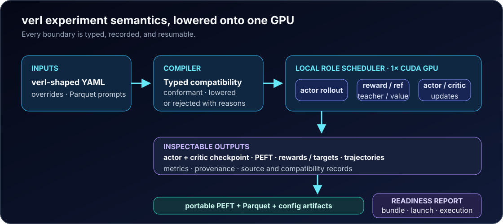

<p align="center">
  
</p>

<div align="center">

[](https://github.com/DaoyuanLi2816/mini-verl/actions/workflows/ci.yml)
[](https://github.com/DaoyuanLi2816/mini-verl/actions/workflows/build.yml)
[](https://pypi.org/project/miniverl/)
[](https://www.python.org)
[](LICENSE)

</div>

<p align="center">
  <a href="https://pypi.org/project/miniverl/"><strong>PyPI</strong></a> ·
  <a href="https://daoyuanli2816.github.io/mini-verl/"><strong>Stable docs</strong></a> ·
  <a href="https://daoyuanli2816.github.io/mini-verl/dev/">Development docs</a> ·
  <a href="README.zh-CN.md">中文</a>
</p>

**Run a documented subset of verl-style on-policy distillation on one consumer
GPU.** miniVERL takes typed verl-shaped YAML and Parquet prompts through actor
rollout → teacher scoring → actor update, records every local reinterpretation,
and exports standard PEFT, Parquet and config artifacts for a pinned scale-out
handoff.

PyPI `v0.9.1` is stable; `main` is development. miniVERL is an independent
project with no upstream endorsement. It does not execute arbitrary verl YAML,
launch distributed jobs, or claim full algorithmic compatibility.

## Pip-only quickstart

Install the matching CUDA-enabled PyTorch build for your machine first, then:

```bash
python -m pip install "miniverl[train,cuda]"
miniverl data sample --format verl-parquet --out prompts.parquet
miniverl plan --profile verl-opd-v0.8-single-gpu-v1 \
  --config builtin:qwen3-0.6b-1.7b-opd \
  --set 'data.train_files=["prompts.parquet"]' --out plan.json
miniverl run --profile verl-opd-v0.8-single-gpu-v1 \
  --plan plan.json --dry-run
```

These commands need no Git checkout. `data sample` creates a real structured
Parquet file, `plan` compiles the complete field matrix without loading weights,
and `run --dry-run` validates the native execution contract. On one NVIDIA CUDA
GPU, remove `--dry-run` to run the pinned Qwen3-0.6B actor and Qwen3-1.7B teacher
recipe and produce an inspectable PEFT adapter.

The `train` extra installs the ML runtime, but does not choose the correct CUDA
PyTorch wheel. The optional `cuda` extra adds bitsandbytes only. Follow the
[one-GPU installation and memory guide](docs/single-gpu-guide.md) before a real
run.

## Architecture

<picture>
  <source media="(max-width: 640px)" srcset="docs/verl-local-runtime-mobile.svg">
  
</picture>

miniVERL uses one ordinary process and schedules model roles in phases. It does
not emulate Ray resource pools or pretend local Hugging Face generation is
vLLM. Instead, the compatibility report retains the source value, explains the
local meaning, assigns a risk level, and fails closed when a field would change
the algorithm or distributed semantics.

The native runtime also remains available for SFT, DPO, offline KD and
tool-aware OPD recipes. Those workflows share strict token provenance,
pickle-free teacher caches, transactional checkpoints and adapter export, but
the verl-shaped profile is the shortest route for an existing verl user.

### One local scheduler, explicit roles

The actor generates from the current adapter; the teacher scores exactly those
visited token positions; the actor then receives a padded, token-mean update.
The teacher is never treated as a reward model, tool output never becomes a
training label, and a stale actor-policy version cannot enter an on-policy
batch. Memory planning chooses resident phased roles for quantized models,
swap only for movable unquantized roles, or compatible shared-backbone
placement while keeping actor, teacher and reference identities distinct.

Each phase writes evidence before the next boundary: structured trajectories
carry per-token provenance, top-k teacher targets are checksummed without
pickle, checkpoints publish transactionally, and the final adapter is verified
with the standard PEFT loader. A crash can therefore be inspected and resumed
without reconstructing intent from console text.

## Coming from verl?

| What you do in verl | miniVERL equivalent |
| --- | --- |
| pass Hydra-style overrides | repeat `--set`; v0.9 development also accepts `--overrides-file` and tokens after `--` |
| inspect the resolved config | `miniverl plan --json` |
| execute pure OPD | `miniverl run` |
| reuse prompt Parquet | point `data.train_files` at it directly |
| allocate rollout/teacher workers | compile resource intent into local phases |
| save an FSDP/Megatron checkpoint | unsupported |
| prepare a scale-out handoff | `miniverl export-verl` |

The same field names stay visible:

```bash
# familiar resolved intent
actor_rollout_ref.model.path=Qwen/Qwen3-0.6B
distillation.teacher_models.teacher_model.model_path=Qwen/Qwen3-1.7B

# bounded local compilation
miniverl plan --profile verl-opd-v0.8-single-gpu-v1 --config verl-opd.yaml \
  --set actor_rollout_ref.actor.optim.lr=1e-5
```

External YAML must explicitly accept the high-risk local mappings printed by
`plan` before `run`; the packaged profile carries a value-bound reviewed
manifest. [Override precedence and safe input forms](docs/config-overrides.md)
are documented without executing Hydra interpolation or shell text.

The public built-in profile deliberately uses upstream-shaped `name: vllm`
values. miniVERL classifies both rollout and teacher engine names as local
reinterpretations and executes them with sequential local HF phases; this is
not vLLM equivalence. See [For verl users](docs/for-verl-users.md) for config,
data, role and error mappings.

## Tested profile boundary

Use `miniverl profiles list`, `profiles show/schema`, and `compat
explain/check` to inspect the closed built-in registry and distinguish an
accepted field from one with a demonstrated native effect. New plans, caches,
checkpoints and exports bind the complete independent profile identity.

`verl-opd-v0.8-single-gpu-v1` pins official verl `v0.8.0` at commit
`7aed6b230776f963fa09509c10d9c3a767d1102c`. Its executable path is intentionally
narrow:

- one trainable actor and one teacher;
- one generated response per prompt (`n=1`);
- reward-free generalized knowledge distillation;
- `forward_kl_topk` with teacher top-k IDs/log-probabilities, mass/overlap
  diagnostics and token-mean aggregation;
- LoRA or QLoRA adapter updates on one CUDA GPU;
- immutable model revisions and verl-style structured prompt Parquet.

Policy-gradient OPD, task rewards, KL penalties, multi-teacher routing,
multimodal inputs, PPO, GRPO, critics, Ray, FSDP, Megatron, multi-GPU and
multi-node execution are unsupported. Known unsupported values receive a
machine-readable classification; unknown fields and unresolved `${...}`
interpolations are rejected. A resolved profile subset is input—not an
arbitrary launch script.

## Measured RTX 4080 path

The Qwen3-0.6B/1.7B developer workload consumed **32 distinct prompts**, each
with a 64-token response bound, and completed **8 current-policy updates** at
**3.1914 GiB peak reserved VRAM**. Median steady-state rollout, teacher-scoring
and update times were 9.7200, 0.4864 and 2.3260 seconds. A matched 4-update
interruption resumed to the same byte-identical trajectories, adapter and
optimizer tensors. See the [data-bound figure and full record](docs/verl-opd-reference-workload.md);
the original one-update [pip smoke](docs/opd-quickstart.md) remains preserved.
A separate pinned SmolLM2-360M/1.7B compatibility smoke completed one full
rollout/scoring/update cycle; it is not a second measured recipe.

This is deliberately a runtime and artifact proof. It is not a throughput
benchmark, an alignment-quality endpoint, or evidence that OPD beats SFT, DPO
or KD. Other NVIDIA GPUs use the same device-name-agnostic CUDA path, but model
fit depends on VRAM, context length, quantization and installed kernels.

### Choose a path by hardware, not GPU branding

| Situation | Recommended starting point | What remains constant |
| --- | --- | --- |
| inspect on CPU or a laptop | `plan` and `run --dry-run` | full config classification |
| one CUDA GPU with limited VRAM | QLoRA with resident local phases, or unquantized LoRA with swap | logical batch and loss semantics |
| same-base actor and teacher adapters | shared-backbone mode | explicit role provenance |
| more VRAM available | larger physical phase batches | source data and optimizer intent |

Automatic BF16/FP16 selection follows device support; it is not inferred from
marketing names such as 3070, 4080, 5090 or Titan. `miniverl doctor` reports the
installed CUDA/PyTorch path. Normal planning is weight-free; explicit
`plan --probe` adds bounded, cached CUDA measurements with zero optimizer
updates. See [hardware planning](docs/hardware-planning.md). There is no
automatic downgrade to a different model,
teacher, context, top-k or loss when memory is tight.

## Data and artifact interoperability

The profile consumes structured verl-style Parquet without substituting a toy
environment. Prompt roles and content remain structured; data source, ability
and extra metadata survive conversion. `miniverl convert-dataset` is available
when crossing the native trajectory boundary, and rejects lossy rows unless the
operator explicitly permits a partial conversion.

A completed local run contains the resolved source config, compatibility
matrix, local execution plan, trajectories, selected teacher targets,
checkpoints, measurements and a PEFT adapter. Inspect before moving it:

```bash
miniverl inspect runs/my-opd/trajectories.jsonl
miniverl cache stats runs/my-opd/teacher-cache
miniverl export-verl --run runs/my-opd --target-verl v0.8.0 --out scaleout
miniverl bridge materialize scaleout --download --offline
miniverl bridge doctor scaleout --json
```

The v0.9 export preserves student/teacher identities, Parquet bytes and pure
OPD overrides, but reports `launchable: false` until exact base snapshots are
materialized and validated against the installed pinned verl commit. Only then
does `bridge materialize` publish a checksummed `launch.sh`; distributed
execution remains untested. Review the [current scale-out contract](docs/verl-opd-scaleout.md),
[legacy bridge](docs/legacy-verl-bridge.md) and [compatibility policy](docs/compatibility.md).

The intended operating loop is **plan → inspect → run → inspect → export**.
`plan --out` byte-binds the YAML, ordered overrides and scanned Parquet inputs
to the exact native config; `run --plan` rejects drift before loading weights.
Its digest follows the run manifest, teacher cache and checkpoints. Direct
`run --config` remains available for experiments. See [immutable execution
plans](docs/immutable-plans.md).

## Research and validation

miniVERL keeps every measured study—including negative results, superseded
runs and preregistered early stops—public under the documentation. None is used
as a claim that OPD universally beats SFT, DPO or KD: see the
[v0.7 External Alignment Gate](docs/alignment-external/alignment-external-v1.md),
[Alignment Lab](docs/alignment-lab/alignment-lab-v1.md),
[RecoveryBench](docs/recoverybench/recoverybench-v1.md), and the
[calculator study](docs/benchmarking.md).

New runs establish tokenizer compatibility through structural identity. The
legacy behavioral fingerprint is retained only for migration and is not an
identity proof. Scientific caveats and immutable source hashes remain in the
detailed reports and [limitations](docs/limitations.md).

## Development, security and license

```bash
git clone https://github.com/DaoyuanLi2816/mini-verl.git
cd mini-verl
python -m pip install -e ".[dev]"
pytest -q -m "not gpu and not network"
```

Contributions should keep the one-GPU boundary explicit and include tests for
new failure modes. Report vulnerabilities privately through
[SECURITY.md](SECURITY.md). See [CONTRIBUTING.md](CONTRIBUTING.md), the
[changelog](CHANGELOG.md), [citation metadata](CITATION.cff),
[reproducibility guide](docs/reproducibility.md), and [Apache-2.0 license](LICENSE).
