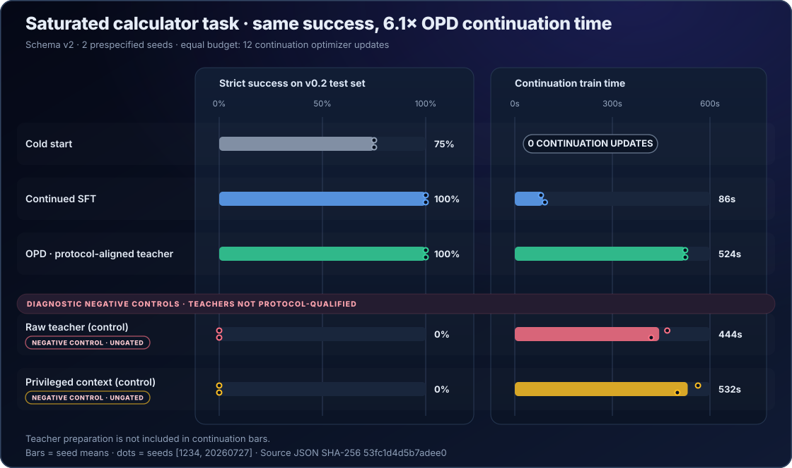
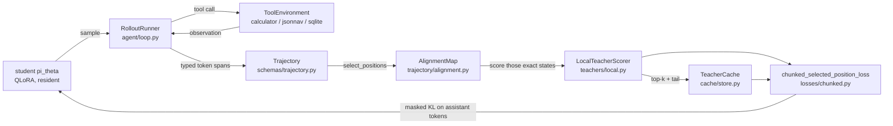

<p align="center">
  
</p>

<div align="center">

[](https://github.com/DaoyuanLi2816/mini-verl/actions/workflows/ci.yml)
[](https://github.com/DaoyuanLi2816/mini-verl/actions/workflows/build.yml)
[](https://www.python.org)
[](LICENSE)

</div>

**On-policy distillation for tool-using agents on one GPU.**

miniVERL trains a small tool-using language model on its own multi-turn
trajectories using teacher distributional targets, without requiring Ray, a GPU
cluster, or a 40 GB accelerator.

```bash
git clone https://github.com/DaoyuanLi2816/mini-verl.git
cd mini-verl
python -m pip install ".[train]"
miniverl demo --output runs/demo        # no network, no GPU, ~50 s on a laptop CPU
```

On a single RTX 4080 (16 GB), the published recipe trains **Qwen3-0.6B** from
**Qwen3-1.7B** on a two-turn calculator task in **481 s / 16 optimizer steps**,
peaking at **4.25 GiB allocated / 4.76 GiB reserved**, and moves held-out greedy
task success from **0.0% to 100.0%** on 12 tasks.

> Read that number honestly: the 8-cycle supervised cold start does most of the
> work — the very first on-policy rollout batch already scored 83.3%. That run
> demonstrates the pipeline end to end on real hardware; it does **not**
> demonstrate that on-policy distillation beats supervised fine-tuning, because
> the task saturates. Every number in this README is reproducible from the
> artifacts recorded in [`docs/rtx4080-baselines.md`](docs/rtx4080-baselines.md).

> [!IMPORTANT]
> **Protocol alignment prevents the observed OPD collapse, but does not beat
> supervised fine-tuning here.** In the schema-v2 equal-update comparison on the
> `hard` split, both prespecified seeds scored **75.0%** at the
> shared cold start, **100.0%** after 12 SFT updates, **0.0%** after OPD from
> either the raw or privileged teacher, and **100.0%** after OPD from the
> protocol-trained teacher. The protocol teacher therefore resolves the main
> confound in the legacy result and ties SFT; it does not establish an OPD
> advantage. See the [full result and legacy transcript diagnosis](docs/rtx4080-baselines.md).



---

## Why miniVERL exists

On-policy distillation is conceptually small and operationally fiddly. The
student samples a trajectory, the teacher scores *exactly the states the student
visited*, and you update on token-level distributional supervision. Four things
go wrong in practice, and all four are silent:

1. **You train on tool output.** The environment's response is context, not a
   label. One wrong mask and the model learns to hallucinate tool results.
2. **You are off by one.** The distribution that predicts token `j` lives at
   position `j - 1`. Get it wrong and the loss still goes down.
3. **You are not actually on-policy.** Reuse a teacher cache across a policy
   update and you are doing offline KD while calling it OPD.
4. **You cannot afford the logits.** A `[batch, seq_len, 152k]` tensor does not
   fit on a consumer card, so the interesting configurations become the ones you
   cannot run.

miniVERL makes each of those a *checked property* rather than a comment, and
keeps the whole thing on one 16 GB card.

## What is implemented

| Area | Status |
| --- | --- |
| Student-sampled multi-turn rollouts with real tool execution | yes |
| Strict per-token provenance (`system` / `user` / `assistant_*` / `tool_result`) | yes, validated on every read and write |
| Exact full-vocabulary forward KL, reverse KL, beta-JSD | yes, checked against brute-force references |
| Compressed `top-k + tail` KL and JSD | yes; the unsmoothed coarse-graining has a proven lower-bound relationship to the exact loss |
| Privileged-context teacher with an explicit alignment map | yes |
| Frozen standard PEFT teacher adapters with provenance and competence gates | yes |
| QLoRA (NF4) student, bf16 or quantized teacher | yes, measured on an RTX 4080 |
| `resident` and `swap` memory strategies, `auto` resolution | yes, with an equivalence test |
| Versioned, checksummed, pickle-free teacher-target cache | yes |
| SFT / offline KD / strict OPD / explicitly labeled replay behind one trainer | yes |
| Calculator, JSON-navigation and SQLite environments | yes, deterministic with exact verifiers |
| Exact checkpoint/resume | yes, asserted parameter-for-parameter |
| Self-contained offline HTML report with token-level divergence | yes |
| Ray, FSDP, DeepSpeed, vLLM, VLMs, cross-tokenizer, PPO/GRPO | **no** — see [limitations](docs/limitations.md) |

## Local toy demo

No network, no GPU, no downloads. Both models are small transformers built from
the config, the tokenizer is a reversible ~190-entry toy tokenizer, and the
calculator environment generates and grades its own tasks.

```bash
python -m pip install ".[train]"       # from the cloned repository; CPU torch is enough
miniverl doctor                        # what can this machine run?
miniverl demo --output runs/demo
```

It runs the real pipeline — student rollouts, tool execution, teacher scoring of
exactly those states, a compressed top-k cache with provenance checks, and a
masked reverse-KL update on assistant tokens only — then prints where every
artifact landed and what to run next:

```text
demo complete  runs/demo
 mode              opd (genuine on-policy distillation)
 optimizer steps   132
 policy versions   13
 wall clock        52.9 s
 token provenance  45597 of 226383 tokens trainable (20%); 180786 are context
                   and can never be a target
 teacher cache     735 scored positions, 131.6 KiB on disk, 2.0x smaller than
                   a dense fp16 dump
 task success      0.0% -> 0.0% (greedy, held-out eval split)

This demo proves the machinery, not capability.
At this size the toy student learns the tool-call format and not the
arithmetic, so 0% here is the expected outcome, not a failure.
For a CPU run that does learn (measured 0.0% -> 91.7% in 192 s):
  miniverl train recipes/toy_cpu.yaml
```

That last line is not a promise, it is a measurement:
`recipes/toy_cpu.yaml` takes **192 s on a CPU** and moves held-out greedy task
success from **0.0% to 91.7%** on 24 tasks, over 600 supervised cold-start steps
plus 40 on-policy distillation cycles. It is also **seed-sensitive** at this
model size: the same 600-step budget gives 81.2% with `run.seed: 1234` and 0.0%
with `run.seed: 20260727`. That variance is exactly why the toy backend is a
machinery harness and capability numbers come from the GPU recipe.

`miniverl inspect` is the one worth running first. It prints the provenance
table, which is the whole point of the project:

```text
tokens by span type (only assistant_* can enter the loss)
+---------------------------------------------+
| span type           | tokens | in loss      |
|---------------------+--------+--------------|
| system              |    776 | no (context) |
| tool_result         |    685 | no (context) |
| user                |    318 | no (context) |
| assistant_tool_call |    153 | yes          |
| assistant_text      |     85 | yes          |
| assistant_final     |     25 | yes          |
+---------------------------------------------+
```

The toy backend is a **machinery harness, not a capability demonstration**. Its
models are too small to solve anything beyond the `easy` split. Capability
numbers come from the GPU recipe.

## Consumer-GPU quickstart

```bash
git clone https://github.com/DaoyuanLi2816/mini-verl.git
cd mini-verl
python -m pip install torch --index-url https://download.pytorch.org/whl/cu130
python -m pip install ".[train,cuda]"

miniverl doctor                                                   # confirms CUDA + bitsandbytes
miniverl validate recipes/qwen_consumer_gpu_calc.yaml
miniverl train    recipes/qwen_consumer_gpu_calc.yaml --dry-run   # nothing is downloaded
miniverl train    recipes/qwen_consumer_gpu_calc.yaml
miniverl report   runs/<run-id> --out runs/<run-id>/report.html
```

The recipe pins both revisions:

| role | model | revision | license |
| --- | --- | --- | --- |
| student | `Qwen/Qwen3-0.6B` | `c1899de289a04d12100db370d81485cdf75e47ca` | Apache-2.0 |
| teacher | `Qwen/Qwen3-1.7B` | `70d244cc86ccca08cf5af4e1e306ecf908b1ad5e` | Apache-2.0 |

Their `tokenizer.json` files are byte-identical
(`sha256 aeb13307a71acd8fe81861d94ad54ab689df773318809eed3cbe794b4492dae4`),
which is what makes the same-tokenizer contract hold. miniVERL verifies it at
load time by behavioural fingerprint and refuses to run otherwise.

## Architecture



Layer boundaries are strict, and the first layer never imports torch:

1. `schemas/`, `trajectory/`, `config/`, `agent/protocol.py` — pure data, masks,
   validation.
2. `losses/` — torch numerics, no model knowledge.
3. `models/` — backends and the architecture adapter.
4. `environments/`, `agent/` — task and tool semantics.
5. `training/`, `teachers/`, `cache/`, `selection/` — orchestration.
6. `evaluation/`, `reporting/` — measurement.
7. `cli.py` — a thin shell that calls one library function per command.

See [`docs/design.md`](docs/design.md).

## Exact versus top-k + tail

Two clearly named classes of objective, because conflating them is how
distillation results become unreproducible.

**`exact_full_vocab`** materializes the complete `[chunk, V]` teacher and student
distributions and computes the real divergence. Affordable when `V` is small (the
toy backend) or when the teacher stays resident and the distribution is rebuilt
one chunk at a time. Guarded by `loss.exact_max_vocab` (default 8192) so it can
never silently try to persist a `[positions, 152k]` tensor.

**`bucketed_topk_tail`** coarse-grains the vocabulary into the teacher's top-k
tokens plus one aggregate tail bucket, then computes the divergence between the
two `K+1` category distributions. This is **not** full-vocabulary KL. The
data-processing lower-bound theorem applies to the unsmoothed coarse-graining;
the finite implementation floors and renormalizes non-empty tails, so it is
described as an epsilon-smoothed objective rather than claiming the theorem
literally for every input. When `k == V`, the empty tail bypasses smoothing and
the implementation reproduces the exact objective to `1e-9` in float64 tests.
The functions are named `bucketed_forward_kl`, `bucketed_reverse_kl` and
`bucketed_jsd` so that no call site can pretend otherwise.

What the compression actually buys is teacher-side storage and the ability to
evict the teacher from VRAM. It does **not** proportionally reduce teacher FLOPs:
the teacher still runs a full forward pass to produce the hidden states. Reports
therefore say `teacher_queried_position_ratio`, never "teacher compute saved".

Top-k + tail targets are not a new idea — TRL's `ServerDistillationTrainer` has
`loss_top_k` with an optional tail bucket. See [`docs/math.md`](docs/math.md).

## Tool-token masking

Every trajectory is a flat token sequence plus a partition into typed spans. The
three masks are stored *and* re-derived from the spans on every read; a file
whose mask disagrees with its spans is rejected rather than trained on.

```python
from miniverl.trajectory.io import read_trajectories

traj = read_trajectories("runs/demo/trajectories.jsonl")[0]
print(traj.token_counts_by_span_type())
# {'system': 194, 'user': 40, 'assistant_tool_call': 38, 'tool_result': 34, 'assistant_final': 7}
print(sum(traj.model_generated_mask))  # only assistant_* tokens are trainable
```

Context segments own the trailing `<|im_start|>assistant\n` header, so a model
span begins at exactly the first sampled token and no forced scaffolding token is
ever a target. Position `0` can never be a target. Both are enforced, not
documented — see `tests/unit/test_token_provenance.py`.

## Benchmark results

Every number below was produced by the commands in
[`docs/benchmarking.md`](docs/benchmarking.md) on the hardware recorded in each
result file. Nothing is estimated or extrapolated.

* **RTX 4080, real models** — [`docs/rtx4080-baselines.md`](docs/rtx4080-baselines.md)
  has measured peak VRAM, decode throughput, the full-recipe run, the two-seed
  schema-v2 protocol-teacher comparison, and the preserved legacy comparison.
* **CPU, toy models** — `recipes/toy_cpu.yaml` moves task success from 0.0% to
  91.7% in 192 s, and `benchmarks/results/` holds the legacy equal-update parity
  run.
  The parity run's accuracy differences are **within noise**; it exists to show
  that all seven arms run to completion under identical budgets, not to rank
  them. See [`benchmarks/README.md`](benchmarks/README.md) for why the toy
  backend cannot rank methods.

## Installation

| Layer | Install | What you get |
| --- | --- | --- |
| Core | `python -m pip install .` | `doctor`, `validate`, `inspect`, `report`, `cache`, the schemas and the Python API. No torch. |
| Training | `python -m pip install ".[train]"` | `demo`, `train`, `eval`, `benchmark`. Adds torch, transformers, peft, accelerate. |
| 4-bit | `python -m pip install ".[cuda]"` | bitsandbytes, for NF4 QLoRA and the 8-bit optimizer. |
| Development | `python -m pip install ".[dev]"` | pytest, hypothesis, ruff, mypy, build, twine. |

Install the CUDA build of torch that matches your driver separately; the PyPI
wheel is CPU-only on some platforms:

```bash
pip install torch --index-url https://download.pytorch.org/whl/cu130
```

A missing extra never produces a traceback:

```text
$ miniverl demo --output runs/demo
error miniverl demo requires the optional dependency 'torch', which is not installed.
hint  pip install "miniverl[train]"
```

## Python API

The public surface is deliberately small.

```python
from miniverl.config import RunConfig
from miniverl.trainer import OPDTrainer

config = RunConfig.from_yaml("recipes/toy_cpu.yaml")
trainer = OPDTrainer.from_config(config)
result = trainer.train()

print(result.run_dir, result.global_step, result.eval["success_rate"])
```

## A custom environment

Subclass `ToolEnvironment`, register it, and every recipe key works unchanged.
`examples/custom_environment/` is a complete, runnable example.

```python
from miniverl.environments import ToolEnvironment, ToolSpec
from miniverl.environments.registry import register


@register
class ReverseEnvironment(ToolEnvironment):
    name = "reverse"

    def tool_specs(self) -> list[ToolSpec]:
        return [
            ToolSpec(
                name="reverse",
                description="Reverse a string.",
                parameters={"text": "string to reverse"},
                required=("text",),
                example={"text": "abc"},
            )
        ]

    # reset / step / verify / generate_task / oracle_actions follow; see the example.
```

## A custom teacher

Implement `TeacherScorer.score` and return supervision for the aligned positions.
`examples/custom_teacher/` shows a scorer that sharpens a local model's
distribution before handing it over, and asserts that the result still trains.

For a standard frozen PEFT teacher adapter, including the Qwen3 protocol-SFT
recipe, export command, compatibility checks and policy-competence gate, see
[`docs/teacher-adapters.md`](docs/teacher-adapters.md).

## Limitations

The short version; the full list is in [`docs/limitations.md`](docs/limitations.md).

* Same tokenizer only. Cross-tokenizer distillation is rejected with an error.
* One trajectory per forward pass — `gradient_accumulation_steps` *is* the batch
  size. The current release has no padded batching.
* `swap` is unavailable for quantized models, because bitsandbytes parameters are
  pinned to the device they were quantized on.
* Only Qwen3 and Qwen2 architectures are tested. Others may work through the
  architecture adapter; nothing here claims they do.
* The primary GPU comparison has two prespecified seeds; legacy GPU artifacts
  are single-seed. No statistical significance is claimed.
* On the measured machine, decoding is kernel-launch bound rather than compute
  bound, so throughput figures are platform-specific.

## Reproducibility

Every run writes `manifest.json` with the miniVERL version, git commit, Python
and OS, torch/CUDA/driver versions, GPU model and VRAM, model ids **and resolved
revisions**, tokenizer fingerprint, seeds, precision, quantization, memory
strategy, loss mode, top-k, policy version, and a `measurement_status` block
recording whether each result was measured, simulated or not run. It records no
usernames, hostnames, home paths, or environment variables beyond a short
allowlist of ones that change numerics — asserted by a test.

See [`docs/reproducibility.md`](docs/reproducibility.md).

## Roadmap

Not implemented, not promised, listed so the scope is unambiguous:
cross-tokenizer distillation, padded multi-sequence batching, entropy-aware
divergence mixing (arXiv:2603.07079), additional model families, more
environments, and multi-GPU. For anything at cluster scale, use verl.

## Acknowledgement and disclaimer

> miniVERL is an independent project and is not affiliated with or endorsed by
> the verl project, ByteDance, or Volcano Engine. It is not a drop-in
> replacement for verl.

The name is a nod to the problem space, not a claim of compatibility. verl is an
excellent, much larger system that also implements on-policy distillation and
multi-turn tool use — at cluster scale, with Ray. If you have a cluster, use it.
miniVERL exists for the case where you have one consumer GPU and want to read
every line of what is happening. See [`docs/comparisons.md`](docs/comparisons.md).

## Citation

```bibtex
@software{miniverl2026,
  title   = {miniVERL: On-policy distillation for tool-using agents on one GPU},
  author  = {Li, Daoyuan},
  year    = {2026},
  url     = {https://github.com/DaoyuanLi2816/mini-verl},
  license = {Apache-2.0}
}
```

See [CITATION.cff](CITATION.cff) and [CHANGELOG.md](CHANGELOG.md).
Contributions: [CONTRIBUTING.md](CONTRIBUTING.md). Security:
[SECURITY.md](SECURITY.md).

## License

Apache-2.0. See [LICENSE](LICENSE) and
[THIRD_PARTY_NOTICES.md](THIRD_PARTY_NOTICES.md).

Chinese translation: [README.zh-CN.md](README.zh-CN.md).
