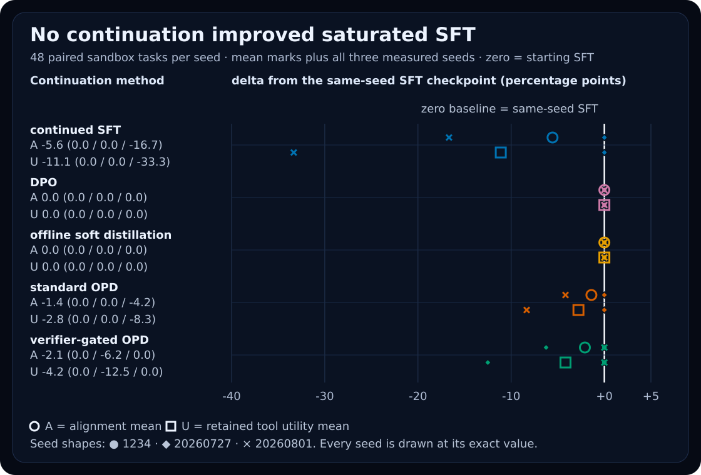
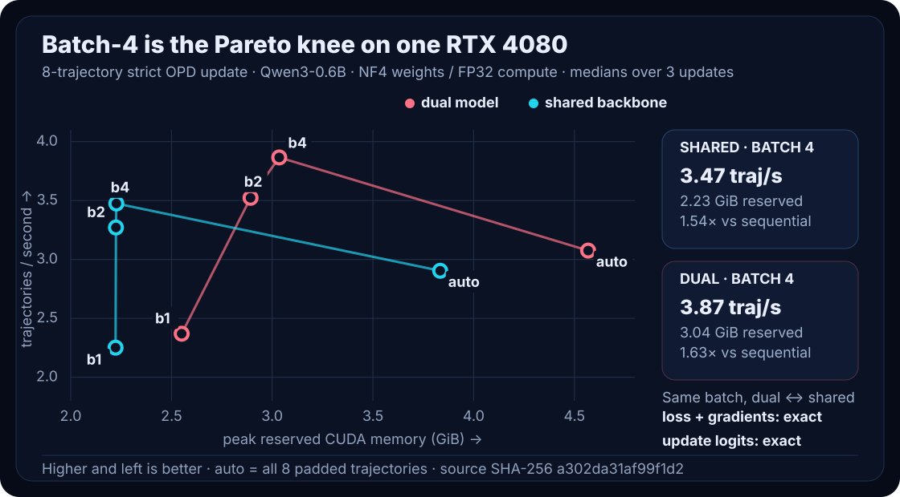
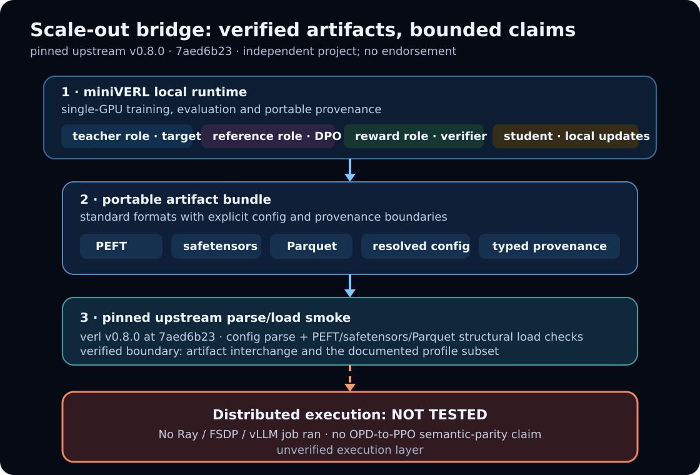

<p align="center">
  
</p>

<div align="center">

[](https://github.com/DaoyuanLi2816/mini-verl/actions/workflows/ci.yml)
[](https://github.com/DaoyuanLi2816/mini-verl/actions/workflows/build.yml)
[](https://pypi.org/project/miniverl/)
[](https://www.python.org)
[](LICENSE)

</div>

<p align="center">
  <a href="https://pypi.org/project/miniverl/"><strong>PyPI</strong></a> ·
  <a href="https://daoyuanli2816.github.io/mini-verl/"><strong>稳定版文档</strong></a> ·
  <a href="https://daoyuanli2816.github.io/mini-verl/dev/">开发版文档</a> ·
  <a href="README.md">English</a>
</p>

**miniVERL 是一个本地、可检查的单卡 LLM 对齐与蒸馏运行时，只实现有明确
文档的功能子集。** 它显式保存 rollout 来源、仅 assistant token 的 loss
掩码、教师目标、更新预算与运行产物，并通过 fail-closed 桥接把可移植产物
交给一个锁定的上游 verl 配置。

PyPI `v0.6.0` 是稳定版；`main` 是开发版。CUDA 路径没有显卡型号白名单，
但能否运行取决于模型组合、上下文预算、内核和显存。miniVERL 独立于 verl，
不声称已经验证分布式执行或完整算法兼容性。

## 安装与 60 秒演示

```bash
python -m pip install "miniverl[train]"
miniverl doctor
miniverl demo --output runs/demo
miniverl inspect runs/demo
```

这个确定性演示无需网络或 GPU，会执行一次真实的玩具优化；在实测笔记本
CPU 上约需 50 秒。若只需要 schema、检查与报告，可安装
`pip install miniverl`。CUDA 训练请先安装与本机匹配的 CUDA PyTorch wheel，
再安装 `miniverl[train,cuda]`；这个 extra 本身不会选择 CUDA 版 PyTorch。
详见[单卡 GPU 指南](docs/single-gpu-guide.md)。

## 三条使用路径

| 路径 | 起点 | 真实产物 | 下一步 |
| --- | --- | --- | --- |
| **Align** — 只有 pilot 证据支持成本时，才在 SFT、DPO、KD 与 OPD 间选择 | `miniverl pilot recipes/alignment_policy_conditioned_qwen.yaml` | `alignment-card.json` | [Alignment Lab](docs/alignment-lab/alignment-lab-v1.md) |
| **Distill locally** — 在一张 CUDA GPU 上运行严格 OPD、共享 backbone 与 padded trajectory update | `miniverl train recipes/qwen_consumer_gpu_shared.yaml --dry-run` | `config.resolved.yaml` 与锁定 revision 的 PEFT adapter | [使用自己的 GPU](docs/single-gpu-guide.md) |
| **Scale out** — 导入已文档化 profile、转换 Parquet、导出 bundle 并执行 bridge 检查 | `miniverl bridge doctor scaleout-bundle` | `provenance/compatibility-report.json` | [verl 桥接](docs/verl-bridge.md) |

桥接导入不是通用 YAML 转换。当数据集/环境、教师身份、目标函数或 schedule
语义不完整时，`import-verl` 只会写出 `import-report.json` 和不可执行的
`imported.template.yaml`，状态为 `needs_user_input`。它不会悄悄改用
calculator 环境，也不会创建身份不明确的同基座教师。

## 一项对齐实测结果

Alignment Lab v1 是一个**已饱和的工具策略案例研究**，不是广义安全评测。
共同的 SFT 起点在三个 seed 上都已经达到 100% 策略合规和 100% 工具效用。
没有 continuation 方法能够继续提升；continued SFT 与两种 OPD 的实测退化
均被保留。

| continuation | 对齐 | 工具效用 | 教师查询 | GPU 时间 |
| --- | ---: | ---: | ---: | ---: |
| continued SFT | 94.4% | 88.9% | — | 3.9 s |
| DPO | 100.0% | 100.0% | — | 8.6 s |
| offline soft distillation | 100.0% | 100.0% | 100.0% | 26.6 s |
| standard OPD | 98.6% | 97.2% | 100.0% | 76.7 s |
| verifier-gated OPD | 97.9% | 95.8% | 46.8% | 66.0 s |



两个 sandbox 安全检查都为零，但工具效用仍然退化。IFEval、XSTest、
HarmBench 与 RewardBench **没有实际执行**。“preference win rate” 是确定性
Minipolicy 配对结果，不是人类偏好。详见[完整研究、逐 seed 数值和局限](docs/alignment-lab/alignment-lab-v1.md)。

## 一项系统实测结果

在一张 RTX 4080、Qwen3-0.6B 和八条固定 SQLite trajectory 上，物理 batch 4
把 dual-model runtime 的更新吞吐从 2.369 提高到 3.866 trajectories/s。
shared-backbone 的 batch-4 cell 峰值 reserved memory 为 2.227 GiB，dual
model 为 3.035 GiB，但前者慢 10.1%。全部 12 个预注册等价性比较通过。
这些是单任务、单机器结果，不是对其他 GPU 的保证。



[Consumer Runtime v1 方法与局限](docs/consumer-runtime-v1.md)

## 兼容性边界



桥接锁定官方 verl `v0.8.0`、commit `7aed6b23`，并使用
**miniVERL-defined compatibility Level 3** 这一名称。它表示 checksummed
标准产物 bundle 与锁定上游版本的 config-parse/model-data-load smoke，
不表示任意 verl YAML 都兼容，也不表示完成过分布式任务。

当前导出的 bundle 有意报告 `launchable: false`：base snapshot 不在 bundle
中，reward 实现仍 fail closed，而且必要的用户映射仍是 placeholder。因此
入口名为 `launch.template.sh`。报告会分别给出 artifact 完整性、parse/load
smoke、reward 完整性、launchability、分布式执行和算法语义等价状态。
当前目标是 PPO/reward scaffold，不是 miniVERL OPD 的可执行延续。

## 详细研究与保留的负结果

- [RecoveryBench v1](docs/recoverybench/recoverybench-v1.md)：在预注册主视图中，
  frozen-student KD 优于耗时高得多的 fresh-state OPD；verifier gate 仍为
  `insufficient_evidence`。
- [Alignment Lab v1](docs/alignment-lab/alignment-lab-v1.md)：起始 SFT 已到
  ceiling，因此不宣称任何正向 OPD 结果。
- [Calculator benchmark](docs/benchmarking.md)：两个 negative control 都正常
  完成并测得 0% strict success，不是配置失败。它们使用了历史上有歧义的
  protocol-v1 prompt，因此不能把失败完全归因于教师的内在行为。
- [Consumer Runtime v1](docs/consumer-runtime-v1.md)：padded update batch 与
  shared adapter 在既定容差内保持单次更新目标；rollout 生成仍是逐条执行。
- [局限](docs/limitations.md)、[数学](docs/math.md)、
  [可复现性](docs/reproducibility.md)与[兼容策略](docs/compatibility.md)。

新运行以 tokenizer 结构身份作为主要兼容性检查。旧版 behavioral
fingerprint 只对一个固定 probe 的 token ID 与元数据做摘要，仅用于旧产物迁移，
不能证明两个 tokenizer 的身份相同。

## 范围

miniVERL 只支持单个本地 CUDA 进程，不实现或包装 Ray、FSDP、Megatron、
PPO、GRPO 或分布式 launcher。公开研究只覆盖小型 Qwen3、确定性工具环境与
一张 RTX 4080，不能推出跨模型、跨任务、跨 GPU 或广义安全结论。

```bash
git clone https://github.com/DaoyuanLi2816/mini-verl.git
cd mini-verl
python -m pip install -e ".[dev]"
pytest -q -m "not gpu and not network"
```

项目使用 Apache-2.0 许可证。参见 [CONTRIBUTING.md](CONTRIBUTING.md) 与
[SECURITY.md](SECURITY.md)。项目记录：[默认 GPU 配方](recipes/qwen_consumer_gpu_calc.yaml)、
[冻结的 calculator JSON](benchmarks/results/gpu-calc-hard-equal-update-v2.json)、
[变更记录](CHANGELOG.md)、[引用信息](CITATION.cff)与[许可证](LICENSE)。
