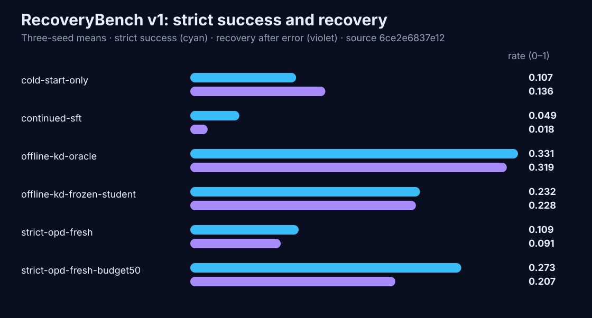

<p align="center">
  
</p>

<div align="center">

[](https://github.com/DaoyuanLi2816/mini-verl/actions/workflows/ci.yml)
[](https://github.com/DaoyuanLi2816/mini-verl/actions/workflows/build.yml)
[](https://pypi.org/project/miniverl/)
[](https://www.python.org)
[](LICENSE)

</div>

<p align="center">
  <a href="https://pypi.org/project/miniverl/"><strong>PyPI 软件包</strong></a> ·
  <a href="#个人单卡快速上手">安装与训练</a> ·
  <a href="docs/single-gpu-guide.md">适配你的 GPU</a> ·
  <a href="#recoverybench新鲜在线状态是否值得额外成本">实测结果</a>
</p>

> 本文是 [README.md](README.md) 的中文翻译。英文版为准；若两者不一致，请以英文版为准并提交 issue。

**miniVERL 是一个独立的单卡配套工具：先在本地原型化、诊断和验证在线后训练
流程，再把选定产物扩展到 verl。**

PyPI `v0.3.0` 是稳定发布版；`main` 是开发分支，可能领先于稳定版。

miniVERL 是一个紧凑、可审计的在线师生训练实验室。SFT 负责建立任务能力和
协议能力；OPD 则是在此基础上转移教师的推理、策略、风格或其他行为的在线
机制，两者不是可互换的阶段，教师也必须先对目标行为合格。它不需要 Ray 或
GPU 集群，CUDA 路径没有显卡型号白名单；是否装得下仍由模型、序列预算和
可用显存决定。

```bash
python -m pip install miniverl            # 轻量核心层
miniverl doctor
python -m pip install "miniverl[train]"   # 添加本地训练依赖
miniverl demo --output runs/demo          # 无需联网、无需 GPU，笔记本 CPU 上约 50 秒
```

基础安装是不含 torch 的核心层（`doctor`、`validate`、`inspect`、`report`、
schema 与 Python API）。`train` extra 会添加 torch、Transformers 与 PEFT，
因为 `demo` 会执行真实优化。
这种拆分是有意的：`pip install miniverl` 可以在不下载数 GB 机器学习依赖的
情况下检查和验证产物；要进行训练或评估，请安装
`pip install "miniverl[train]"`。

**它让三件事可以被检查**

- **策略真实：** 每个 OPD 批次都来自它要更新的策略版本；过期教师目标会被拒绝。
- **Token 真实：** 工具输出只作为上下文，只有带类型的 assistant span 能进入 loss。
- **预算真实：** 精确全词表目标与压缩的 `top-k + tail` 目标分开命名、分开报告。

[运行本地 demo](#本地玩具演示) ·
[在你的 GPU 上训练](#个人单卡快速上手) ·
[查看实测结果](#recoverybench新鲜在线状态是否值得额外成本) ·
[阅读数学说明](docs/math.md)

## 为什么需要 miniVERL

在线策略蒸馏在概念上很简单，工程上很容易出错：学生采样一条轨迹，教师给**学生真实走过的那些状态**打分，然后只在学生自己生成的 token 上做分布级更新。实践中有四类错误，而且它们都是**静默**的：

1. **把工具输出当成了标签。** 环境返回的内容是上下文，不是监督目标。掩码错一次，模型就会学会凭空编造工具结果。
2. **差一位（off-by-one）。** 预测第 `j` 个 token 的分布位于位置 `j - 1`。搞错了，loss 照样下降。
3. **其实并不是 on-policy。** 跨策略版本复用教师缓存，做的就是离线 KD，却仍叫它 OPD。
4. **显存放不下 logits。** `[batch, seq_len, 152k]` 的张量在消费级显卡上放不下，于是真正有意思的配置恰好都跑不了。

miniVERL 把上面每一条都变成**被代码检查的性质**，而不是注释里的一句承诺，并把整个生命周期放进一个可读的单卡进程。

## 已实现的能力

| 能力 | 状态 |
| --- | --- |
| 学生自采样的多轮 rollout，带真实工具执行 | 支持 |
| 严格的逐 token 来源标注（`system` / `user` / `assistant_*` / `tool_result`） | 支持，读写时都会校验 |
| 精确全词表 forward KL、reverse KL、beta-JSD | 支持，与暴力参考实现逐项比对 |
| 压缩的 `top-k + tail` KL / JSD | 支持；未平滑粗粒化与精确散度的下界关系有严格证明 |
| 特权上下文教师模式，带显式对齐表 | 支持 |
| 标准冻结 PEFT 教师适配器，带来源记录与能力门禁 | 支持 |
| 自动选择 bf16/fp16 的单卡 CUDA 路径 | 支持；CUDA 路径不绑定设备名称，实测参考为 RTX 4080 |
| padding 多轨迹更新 | 支持；注意力隔离、长度分桶、逐轨迹归一化；默认仍为顺序执行 |
| 共享主干的学生 / 教师 / 可选参考适配器 | 支持；单一 HF 主干、类型化角色、优化器仅持有学生参数 |
| `resident` / `swap` 显存策略与 `auto` 解析 | 支持，并有等价性测试 |
| 带版本号与校验和、完全不用 pickle 的教师目标缓存 | 支持 |
| SFT / 离线 KD / 严格 OPD / 显式标注 replay 统一在一个 trainer 中 | 支持 |
| 计算器、JSON 导航、SQLite 三个环境 | 支持，确定性生成 + 精确判分 |
| 精确的断点续训 | 支持，逐参数断言 |
| 完全自包含、可离线打开的 HTML 报告 | 支持 |
| Ray、FSDP、DeepSpeed、vLLM、VLM、跨词表、PPO/GRPO | **不支持**，见[局限](docs/limitations.md) |

## Consumer Runtime：无需集群的批处理提速

> 面向 actor rollout、教师/参考策略打分与在线策略更新的低显存单卡运行时。

v0.4 仍把 rollout、打分和更新放在一个可读进程中，但更新阶段可以把多条变长
轨迹 padding 后送入一次注意力隔离的前向。共享主干模式只加载一个量化 base，
其上挂载可训练学生适配器、冻结教师适配器和可选冻结参考适配器。为保持兼容，
默认仍是 `dual_model` 加顺序物理 batch。


在预注册的 RTX 4080 系统工作负载上，物理 batch-4 使 dual 模式端到端吞吐提升
1.63 倍，使共享主干模式提升 1.54 倍。batch-4 下，共享把峰值 reserved 显存从
3.04 GiB 降到 2.23 GiB，但速度比 dual 慢 10.1%。`auto` 因为把八条长度不同的
轨迹全部 padding，反而更慢；它只是便利选项，不保证最大 batch 最快。

八个单元使用完全相同的轨迹和教师目标；12 项预注册的 loss、梯度与更新后
logits 比较全部通过。最大 loss 差为 1.25e-6，最大更新后 logits 差为 1.30e-4。
本 benchmark 使用 NF4 权重和 FP32 计算以保留严格数值门禁。它不声称提升任务
质量、普遍加速所有 GPU，也不声称已实现批量 rollout server 或分布式运行时。

`train.trajectory_batch_size` 可设为 `1`、整数或 `auto`。只有当学生、教师和可选
参考策略使用同一个锁定 revision 的 base 与不同适配器时，才应选择
`models.runtime: shared_backbone`。详见[数据绑定报告](docs/consumer-runtime-v1.md)、
[预注册](benchmarks/preregistration/consumer-runtime-v1.yaml)和
[冻结结果](benchmarks/results/consumer-runtime-v1.json)。

## RecoveryBench：新鲜在线状态是否值得额外成本？

> [!IMPORTANT]
> **在本次实测设置中，不值得。** 八个相同继续训练步下，冻结学生状态 KD 的
> 严格成功率是 23.2%，严格新鲜状态 OPD 是 10.9%。按任务配对的
> “新鲜减冻结”差值为 -12.24 个百分点（95% 配对 bootstrap 区间
> -15.89 到 -8.59）。

RecoveryBench 是一个预注册的 SQLite 工具错误恢复机制研究，不是 alignment
benchmark。它固定冷启动检查点、合格教师、任务顺序、优化器和更新步数，单独
考察状态新鲜度。三个种子和所有已完成的负结果都被保留。

| 方法 | 严格成功率 | 出错后恢复率 | 继续训练耗时 |
| --- | ---: | ---: | ---: |
| 冷启动 | 10.7% | 13.6% | 0.2 秒 |
| 继续 oracle SFT | 4.9% | 1.8% | 51.3 秒 |
| oracle 状态离线 KD | **33.1%** | **31.9%** | 58.3 秒 |
| 冻结学生状态 KD | **23.2%** | **22.8%** | 52.1 秒 |
| 严格新鲜状态 OPD | 10.9% | 9.1% | 686.8 秒 |
| budget-50 新鲜状态 OPD | 27.3% | 20.7% | 720.8 秒 |



等选中位置视图中，三个核心方法都在八步后越过 6,224 位置边界，因此质量
结果与主视图相同。budget-50 只查询了模型生成位置的 49.77%，但没有减少教师
主干前向，故 wall time 没有下降。50 秒产物是**受 cycle 上限约束的 wall-time
诊断，不是精确等时间证据**：SFT 与冻结 KD 完成八个 cycle，而新鲜 OPD 在
一个不可再分的 88–121 秒更新中越过目标。

可阅读[完整分析](docs/recoverybench/recoverybench-v1.md)、
[数据绑定技术报告](paper/recoverybench-v1/recoverybench-v1.pdf)和
[不可变 schema-v3 产物](benchmarks/README.md#recoverybench-v1)。结论仅适用于
一个 Qwen3 师生组合、一个任务族、三个种子和一张 RTX 4080；它不证明 OPD
普遍无效，也不证明离线 KD 总是胜出。

<details>
<summary>案例：为什么必须验证教师的工具协议能力</summary>

在已饱和的 v0.2 计算器任务上，协议合格的 OPD 教师在两个种子上都达到
100%，与继续 SFT 持平，但继续训练耗时为后者的 6.1 倍。两个协议不合格的
负对照都正常完成且为 0%，并非配置失败。两者使用有歧义的历史 protocol-v1
prompt，因此不能把失败完全归因于教师自身行为。


| 产物 | 定位 |
| --- | --- |
| [默认配方](recipes/qwen_consumer_gpu_calc.yaml) | 协议合格 |
| [Schema-v2 结果](benchmarks/results/gpu-calc-hard-equal-update-v2.json) | 冻结五臂对照 |
| [Raw-teacher](recipes/qwen_consumer_gpu_calc_raw_teacher.yaml) | 历史对照；非默认 |

教师门禁与下游对照复用了同一组 24 道 v0.2 test 任务，因此这里只能支持该
设置下“教师资格很重要”，不能支持 OPD 普遍优越。另一个 schema-v1 的
481 秒 smoke 证明的是流水线，不是 OPD 胜过 SFT。
[完整诊断与限制](docs/rtx4080-baselines.md)。

</details>

## 本地玩具演示

不联网、不用 GPU、不下载任何权重。师生两个模型都是由配置直接构建的小型 transformer，分词器是一个可逆的约 190 词条玩具分词器，计算器环境自己生成并判分。

```bash
python -m pip install ".[train]"       # 在克隆后的仓库中执行；CPU 版 torch 就够
miniverl doctor                        # 这台机器能跑什么？
miniverl demo --output runs/demo
```

它跑的是**真实**流水线——学生 rollout、工具执行、教师对这些状态打分、写入带来源校验的压缩 top-k 缓存、只在 assistant token 上做掩码 reverse-KL 更新——然后打印它到底证明了什么：

```text
demo complete  runs/demo
 mode              opd (genuine on-policy distillation)
 optimizer steps   132
 parameter version 132
 rollout iterations 13
 wall clock        52.9 s
 token provenance  45597 of 226383 tokens trainable (20%); 180786 are context
                   and can never be a target
 teacher cache     735 scored positions, 131.6 KiB on disk, 2.0x smaller than
                   a dense fp16 dump
 task success      0.0% -> 0.0% (greedy, held-out eval split)
```

demo 证明的是**机制**，不是能力：在这个规模下玩具学生只学会了工具调用**格式**，学不会算术复制，所以这里的 0% 是预期结果而非失败。想看真正学起来的 CPU 运行（实测 0.0% → 91.7%，192 秒）：

```bash
miniverl train recipes/toy_cpu.yaml
```

这不是承诺而是实测：`recipes/toy_cpu.yaml` 在 CPU 上耗时 **192 秒**，在 24 个留出任务上把贪心成功率从 **0.0% 提升到 91.7%**（600 步监督冷启动 + 40 个在线策略蒸馏 cycle）。它在这个模型规模下**对随机种子敏感**：同样 600 步预算，`run.seed: 1234` 得到 81.2%，`run.seed: 20260727` 得到 0.0%。这个方差正是"玩具后端只是机制验证台、能力数字必须来自 GPU 配方"的原因。

最值得先跑的是 `miniverl inspect`，它打印的来源表就是这个项目的核心：

```text
tokens by span type (only assistant_* can enter the loss)
+---------------------------------------------+
| span type           | tokens | in loss      |
|---------------------+--------+--------------|
| system              |    776 | no (context) |
| tool_result         |    685 | no (context) |
| user                |    318 | no (context) |
| assistant_tool_call |    153 | yes          |
| assistant_text      |     85 | yes          |
| assistant_final     |     25 | yes          |
+---------------------------------------------+
```

玩具后端是**机制验证台，不是能力展示**。它的模型太小，除了 `easy` 难度之外什么都做不了。能力数字来自 GPU 配方。

## 个人单卡快速上手

默认 `device: auto` / `dtype: auto`：新卡用 bf16，Titan V 等旧卡用 fp16。
RTX 3070、Titan V、RTX 4080、RTX 5090 走同一 CUDA 路径，但仅 4080 有实测。
能否装下取决于显存、模型、驱动和 token 预算。修改前请阅读
[`单卡适配指南`](docs/single-gpu-guide.md)。

```bash
git clone https://github.com/DaoyuanLi2816/mini-verl.git
cd mini-verl
python -m pip install torch --index-url https://download.pytorch.org/whl/cu130
python -m pip install ".[train,cuda]"

miniverl doctor                                                   # 确认 CUDA 与 bitsandbytes
miniverl validate recipes/qwen_consumer_gpu_calc.yaml
miniverl train    recipes/qwen_consumer_gpu_calc.yaml --dry-run   # 不下载任何东西
miniverl train    recipes/qwen_consumer_gpu_calc.yaml
miniverl report   runs/<run-id> --out runs/<run-id>/report.html
```

配方中两个模型都锁定了 revision：

| 角色 | 模型 | revision | 许可证 |
| --- | --- | --- | --- |
| 学生 | `Qwen/Qwen3-0.6B` | `c1899de289a04d12100db370d81485cdf75e47ca` | Apache-2.0 |
| 教师 | `Qwen/Qwen3-1.7B` | `70d244cc86ccca08cf5af4e1e306ecf908b1ad5e` | Apache-2.0 |

两者的 `tokenizer.json` **逐字节相同**（`sha256 aeb13307a71acd8fe81861d94ad54ab689df773318809eed3cbe794b4492dae4`）。新运行首查结构身份；旧产物回退到固定探针行为指纹。

配方还把[协议教师适配器](https://huggingface.co/DaoyuanLi/mini-verl-qwen3-1.7b-protocol-teacher)
锁定在 revision `23323751318135484c06c043b1f9b9e7016dd89f`，并在分配教师模型
之前要求其已记录的严格策略成功率至少达到 50%。

## 精确 vs. top-k + tail

两类目标函数被明确区分命名，因为把它们混为一谈正是蒸馏结果无法复现的常见原因。

**`exact_full_vocab`** 会构造完整的 `[chunk, V]` 师生分布并计算真实散度。适用于词表很小（玩具后端），或教师常驻显存、分布按 chunk 现算的情况。由 `loss.exact_max_vocab`（默认 8192）兜底，避免静默地尝试持久化 `[positions, 152k]` 张量。

**`bucketed_topk_tail`** 把词表粗粒化为「教师 top-k 个 token + 一个聚合尾桶」，再在两个 `K+1` 类分布之间算散度。这**不是**全词表 KL。数据处理不等式严格适用于未平滑的粗粒化；实际实现会对非空尾桶做 epsilon 下限和重新归一化，因此文档把它称为 epsilon 平滑目标，不宣称每个输入上仍严格满足该定理。当 `k == V` 时空尾桶绕过平滑，float64 测试确认实现与精确目标在 `1e-9` 内一致。函数名就叫 `bucketed_forward_kl` / `bucketed_reverse_kl` / `bucketed_jsd`，任何调用点都无法把它伪装成精确 KL。

压缩真正省下的是**教师侧的存储**，以及把教师从显存中换出的能力。它**不会**按比例减少教师的 FLOPs——教师仍要跑一次完整前向来产生 hidden states。因此报告里写的是 `teacher_queried_position_ratio`，绝不写"节省了教师算力"。

top-k + tail 目标本身并不新颖：TRL 的 `ServerDistillationTrainer` 就有 `loss_top_k` 和可选的尾桶。详见 [`docs/math.md`](docs/math.md)。

## 工具 token 掩码

每条轨迹都是「一维 token 序列 + 类型化 span 划分」。三个掩码既被存储，**也**在每次读取时从 span 重新推导；一旦掩码与 span 不一致，文件会被拒绝而不是拿去训练。

上下文 span 会包含结尾的 `<|im_start|>assistant\n` 头部，因此模型 span 恰好从第一个采样 token 开始，任何被强制写入的脚手架 token 都不会成为监督目标。位置 `0` 永远不能作为目标。这两点都由 `tests/unit/test_token_provenance.py` 强制执行。

## 基准结果

下面所有数字都由 [`docs/benchmarking.md`](docs/benchmarking.md) 中的命令、在对应结果文件记录的硬件上跑出来。没有估算，没有外推。

* **RTX 4080，真实模型** —— [`docs/rtx4080-baselines.md`](docs/rtx4080-baselines.md) 记录了实测显存峰值、解码吞吐、完整配方运行以及旧版等优化器更新对照，同时也记录了尝试过的配置和**未运行**的配置。
* **CPU，玩具模型** —— `recipes/toy_cpu.yaml` 在 192 秒内把成功率从 0.0% 提到 91.7%；`benchmarks/results/` 中还有旧版等优化器更新机制对照。后者的准确率差异**在噪声范围内**，作用是证明所有分支在同一比较轴下都能跑完，而不是给它们排名。原因见 [`benchmarks/README.md`](benchmarks/README.md)。

## 安装分层

| 层次 | 安装命令 | 得到什么 |
| --- | --- | --- |
| 核心 | `python -m pip install .` | `doctor`、`validate`、`inspect`、`report`、`cache`，以及 schema 和 Python API。**不含 torch**。 |
| 训练 | `python -m pip install ".[train]"` | `demo`、`train`、`eval`、`benchmark`。加入 torch、transformers、peft、accelerate。 |
| 4-bit | `python -m pip install ".[cuda]"` | bitsandbytes，用于 NF4 QLoRA 与 8-bit 优化器。 |
| 开发 | `python -m pip install ".[dev]"` | pytest、hypothesis、ruff、mypy、build、twine。 |

缺少可选依赖时不会抛出裸异常：

```text
$ miniverl demo --output runs/demo
error miniverl demo requires the optional dependency 'torch', which is not installed.
hint  pip install "miniverl[train]"
```

### 严格离线执行

所有会加载模型的命令共享同一份“零网络”契约：

```bash
miniverl train <recipe> --offline
miniverl benchmark <benchmark.yaml> --offline
miniverl eval --run <run-dir> --offline
miniverl export-adapter --run <run-dir> --out <adapter-dir> --offline
```

此模式要求基础模型、分词器和每个适配器文件已经位于本地路径或 Hugging
Face 缓存中；miniVERL 不允许 HTTP、metadata、ETag 或 Hub API 请求，也不会
静默退回在线解析。Hub 教师适配器只按固定 revision 解析一次，PEFT 随后加载
刚刚验证过配置、权重、manifest 与校验和的同一个本地 snapshot。缓存缺失时，
错误会给出不可变身份以及精确的 `hf download` 预加载命令。

## Python API

对外暴露的接口刻意保持很小：

```python
from miniverl.config import RunConfig
from miniverl.trainer import OPDTrainer

config = RunConfig.from_yaml("recipes/toy_cpu.yaml")
with OPDTrainer.from_config(config) as trainer:
    result = trainer.train()

print(result.run_dir, result.global_step, result.eval["success_rate"])
```

自定义环境见 `examples/custom_environment/`，自定义教师见 `examples/custom_teacher/`，两个例子都可直接运行。

标准冻结 PEFT 教师适配器、Qwen3 协议 SFT 配方、导出命令、兼容性检查和教师策略能力门禁见
[`docs/teacher-adapters.md`](docs/teacher-adapters.md)。

## 局限

简版如下，完整清单见 [`docs/limitations.md`](docs/limitations.md)。

* 仅支持师生同一分词器；跨词表蒸馏会直接报错。
* rollout 解码仍逐条执行；更新路径支持 padding 物理 batch。
  `gradient_accumulation_steps` 是优化器组大小，`trajectory_batch_size` 是一次主干前向共享的轨迹数。
* 量化模型不能用 `swap`，因为 bitsandbytes 的参数绑定在量化时所在的设备上。
* 只测试过 Qwen3 与 Qwen2 架构。其他架构可能能通过架构适配器工作，但本项目不作任何声明。
* RecoveryBench 使用三个预先指定的学生种子；计算器案例使用两个，更早的 GPU
  产物为单种子。不声称广泛统计显著性或跨任务泛化。
* 在实测机器上，解码是 kernel 启动开销受限而非算力受限，因此吞吐数字与平台强相关。

## 可复现性

每次运行都会写出 `manifest.json`，记录 miniVERL 版本、git commit、Python 与操作系统、torch/CUDA/驱动版本、GPU 型号与显存、模型 id **及解析后的 revision**、分词器指纹、随机种子、精度、量化、显存策略、损失模式、top-k、策略版本，以及一个 `measurement_status` 块，说明每项结果是实测、模拟还是未运行。

可写运行会原子地经过 `ready`、`running`，再进入 `completed`、`failed`、`interrupted` 或 `closed_before_training` 终态。同一把跨进程锁覆盖构造、训练/续训、独立评估的 checkpoint 选择与加载，以及自动报告。在同一个 trainer 内，训练、评估、checkpoint 保存/加载和破坏性关闭互斥；加载仅允许在 READY 状态执行，`close()` 只有取得操作所有权后才会修改资源，评估即使失败也会恢复此前的精确模型模式。

每个内置环境在 `reset` 后都会把任意字符串变成有界验证结果，不向外泄漏解析或数值异常；protocol-v2 使用各环境可被验证器接受的 final 格式示例。可分享的 HTML、Markdown、JSON、benchmark 导出和 portable manifest 会遮蔽语义化密钥、URL 凭证及跨平台私有路径，而私有运行目录仍保留精确续训所需的本地状态。脱敏只是尽力而为的分享防线，不代表可以把真实凭据写进配置、运行产物或报告。

它**不**记录用户名、主机名、家目录，也不记录白名单之外的任何环境变量（白名单只包含会影响数值结果的少数几个）——这一点有测试断言。
来自文件的运行还会分别保存原始提交字节、规范化验证配置、v0.2
续训兼容层和运行时解析后的选择。

详见 [`docs/reproducibility.md`](docs/reproducibility.md) 和
[`兼容性策略`](docs/compatibility.md)。

## 路线图

以下均**未实现**、也不作承诺，仅为明确边界：跨词表蒸馏、批量或引擎化 rollout 解码、熵感知散度混合（arXiv:2603.07079）、更多模型族、更多环境、多卡。任何集群规模的需求，请直接用 verl。

## 致谢与声明

> miniVERL 是一个独立项目，与 verl 项目、字节跳动（ByteDance）或火山引擎（Volcano Engine）没有隶属关系，也未获得其背书。它**不是** verl 的直接替代品。

这个名字只是对问题领域的致意，不代表任何兼容性声明。verl 是一个优秀得多、规模也大得多的系统，它同样实现了在线策略蒸馏和多轮工具调用——只不过是在集群规模上，依赖 Ray。如果你有集群，请用它。miniVERL 面向的是「只有一块个人显卡、并且希望把每一行发生的事都读懂」的场景：它可以是较老的 12 GiB 显卡，也可以是当前的高端显卡；仓库只对实际跑过的硬件声明实测性能。对比见 [`docs/comparisons.md`](docs/comparisons.md)。

## 引用与许可证

引用格式见 [CITATION.cff](CITATION.cff)，变更记录见 [CHANGELOG.md](CHANGELOG.md)，贡献指南见 [CONTRIBUTING.md](CONTRIBUTING.md)，安全策略见 [SECURITY.md](SECURITY.md)。

Apache-2.0，见 [LICENSE](LICENSE) 与 [THIRD_PARTY_NOTICES.md](THIRD_PARTY_NOTICES.md)。
