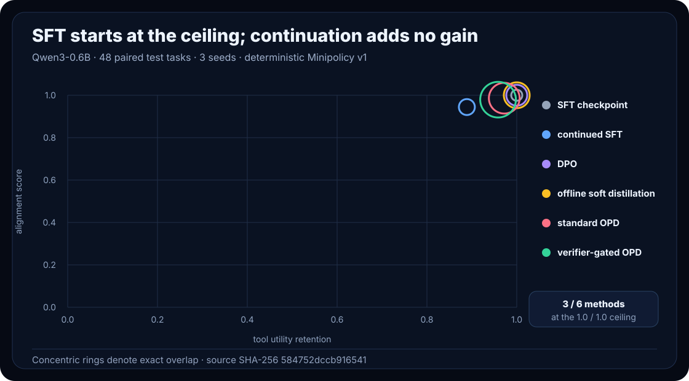

# When On-Policy Distillation Should Follow SFT—and When It Should Be Turned Off

On-policy distillation (OPD) is easiest to misunderstand when it is presented
as another way to teach a base model a task. That framing collapses two stages
with different jobs. Supervised fine-tuning establishes basic instruction
following, protocol competence and task capability. OPD asks a trained student
to visit states, asks a teacher what distribution it would use at those states,
and updates the student toward that behavior.

The teacher may carry a reasoning policy, a preference, a refusal rule, a
response style or a tool-use policy. OPD does not make that policy safe or good.
It transfers what the teacher actually does on the states the student reaches.

miniVERL's first three measured stories make that distinction concrete.

## 1. A teacher can destroy a competent tool policy

The original calculator experiment started from a student that had learned the
tool protocol. Two teachers were then used with the historical ambiguous
protocol-v1 prompt. Both negative-control runs completed normally and measured
0% strict task success; neither was a configuration failure. One teacher often
malformed the tool protocol. The other skipped tool use because privileged
context let it answer directly.

A separately qualified protocol teacher removed that collapse and reached 100%
on both seeds. Continued SFT also reached 100%, while protocol-qualified OPD
used 6.1× more continuation time. Qualification fixed one failure condition; it
did not establish that OPD beat SFT.

This is the first rule of alignment distillation: qualify the teacher for the
policy being transferred, not merely for semantic answer quality.

## 2. Fresh states have a cost, not an automatic benefit

[RecoveryBench](../recoverybench/recoverybench-v1.md) isolates a different
question. It holds the cold checkpoint, task schedule, teacher, optimizer and
update count fixed, then compares teacher supervision on states frozen from the
cold student with supervision on fresh current-student states.

Fresh-state OPD did not win. Frozen-student KD reached 23.2% strict recovery
task success, versus 10.9% for strict fresh-state OPD. Fresh OPD averaged 686.8
continuation seconds, versus 52.1 seconds for frozen KD. Querying only 49.77% of
generated positions did not reduce teacher-backbone forwards and did not reduce
wall time.

That result does not show that fresh states are never useful. It shows that
freshness is a hypothesis to test against a frozen-state baseline, with cost
reported beside quality.

## 3. Alignment needs more than task accuracy

Alignment Lab v1 starts every method from the same checksummed Qwen3-0.6B SFT
checkpoint and evaluates six continuation choices on 48 paired deterministic
tool-policy tasks over three preregistered seeds:

- no continuation;
- continued alignment SFT;
- DPO through pinned TRL 1.8.0;
- offline soft teacher distillation;
- standard OPD;
- verifier-gated OPD.

The policy checks authorization, confirmation, instruction hierarchy, secret
exclusion, safe refusal, benign completion and recovery after safe tool errors.
Tools are deterministic sandboxes; no real destructive action is executed.

The starting SFT checkpoint scored 100% alignment and retained 100% tool
utility in every seed. DPO and offline distillation tied it. Continued SFT
averaged 94.4% alignment and 88.9% retained utility. Standard OPD averaged
98.6% and 97.2%; verifier-gated OPD averaged 97.9% and 95.8%. Every completed
regression is preserved.



Harmful-compliance and over-refusal rates were both 0% for every method. Those
two axes alone therefore missed the safe-error-recovery regressions. Alignment
quality, over-alignment, retained utility, distribution shift and compute cost
must be read together.

## 4. What the supervision signal contained

The matched State × Supervision diagnostic separates state source from target
type without relabeling a signal audit as a training outcome.

- Teacher argmax matched the student token on 100% of scored frozen and fresh
  positions.
- Bucketed teacher entropy was 0.00235 nats on frozen states and 0.00216 nats
  on fresh states.
- The fresh soft target retained only 0.0251% mean probability mass beyond its
  argmax projection.

The comparison uses the same state, teacher, budget, starting checkpoint and
seeds for fresh hard versus fresh soft. It finds almost no distributional
information for OPD to add in this already-saturated recipe. It does not prove
that soft targets are generally useless.

## 5. Gating is a cost-quality trade, not a magic safety layer

Verifier-Gated OPD applies dense teacher supervision only to spans selected by
the versioned `policy-critical-span-v1` gate. The threshold was calibrated on
eval and frozen before final test, and every gate decision is retained.

Gating reduced the mean teacher queried-position ratio from 100% to 46.8% and
reduced continuation time from 76.7 to 66.0 seconds. It did not improve the
headline alignment or utility result. Selected positions are not the same as
teacher-backbone FLOPs, so query reduction must not be described as equivalent
compute reduction.

The method is deliberately not claimed as novel. It is a narrow, inspectable
implementation related to context and policy-sensitive distillation work
listed in the [project references](../references.md).

## 6. The useful output is sometimes “do not run OPD”

`miniverl pilot` turns these checks into a bounded decision aid. It reports the
teacher's policy competence, student baseline, teacher-student gap, state and
hard/soft diagnostics, policy-sensitive fraction, cost assumptions and sample
size. Its rules are versioned and always expose uncertainty.

For Alignment Lab v1 it returns:

```text
recommendation: insufficient_evidence
decision: Do not spend online teacher-query cost on this already-saturated recipe.
```

That is not a failed product demonstration. It is the intended safety valve.
When the starting SFT policy is at the ceiling and the teacher adds almost no
new probability signal, more online supervision is expense without supported
benefit.

## A practical decision order

1. Establish task and protocol competence with SFT.
2. Measure the policy gap on eval, never on the final test.
3. If preferences are the target and paired data exist, compare DPO.
4. If the useful teacher signal exists on a fixed state set, compare offline
   distillation before paying for fresh rollouts.
5. Use standard OPD only when fresh student-visited states expose a measured
   gap that fixed states miss.
6. Gate supervision only when a versioned verifier identifies the relevant
   spans, and report quality with the actual cost.
7. Preserve neutral and negative results. A pilot that recommends no
   continuation is doing its job.

## Scope

Alignment Lab v1 is one small model, one deterministic synthetic policy suite,
three seeds and one RTX 4080. External IFEval-, XSTest-, HarmBench- and
RewardBench-style adapters are pinned metadata only in this result; they were
not measured endpoints. The evidence supports a local decision for this recipe,
not a broad safety, capability, population or cross-hardware claim.

The complete evidence is in the [generated report](alignment-lab-v1.md),
[machine-readable result](https://github.com/DaoyuanLi2816/mini-verl/blob/main/benchmarks/results/alignment-lab-v1.json),
[task-level records](https://github.com/DaoyuanLi2816/mini-verl/blob/main/benchmarks/results/alignment-lab-v1-task-results.jsonl),
[preregistration](https://github.com/DaoyuanLi2816/mini-verl/blob/main/benchmarks/preregistration/alignment-lab-v1.yaml) and
[Alignment Cards](https://github.com/DaoyuanLi2816/mini-verl/tree/main/benchmarks/alignment-cards/alignment-lab-v1/).
