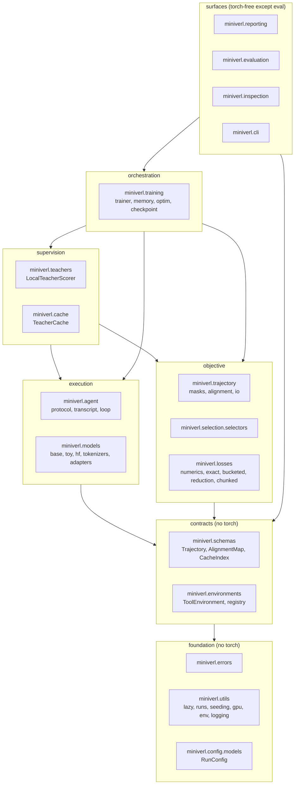
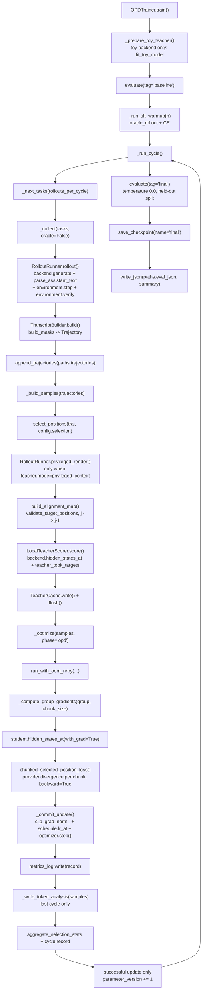

# miniVERL design

This document explains what miniVERL is for, how it is layered, what happens
during one on-policy distillation (OPD) cycle, and which invariants are checked
where. Every module, function, field name and file name below was read out of
the source tree; every number was produced by a command that was run.

For the mathematics of the objectives see [math.md](math.md).

---

## 1. The problem

On-policy distillation trains a small student on **its own** rollouts, scored by
a larger teacher at exactly the states the student visited. Compared with
supervised fine-tuning on teacher text, it removes the train/inference
distribution mismatch; compared with RL from a scalar reward, it gives dense
per-token supervision.

For a tool-using agent the setting adds a complication that most distillation
code does not handle: the trajectory is not one contiguous block of model
output. It interleaves a system prompt, a user prompt, model-generated tool
calls, environment observations, and a final answer. Tool output is *context*
that the model must condition on but must never be trained to reproduce. Getting
that wrong does not crash anything — it silently trains the policy to hallucinate
tool results.

miniVERL is a single-GPU implementation of that loop with three properties it
tries to make checkable rather than aspirational:

1. **Token provenance is a validated data structure, not a convention.** Every
   token belongs to exactly one typed span, the masks are re-derived from the
   spans on every load, and a mismatch raises.
2. **"On-policy" is enforced by the cache, not by the docstring.** Teacher
   targets carry the `policy_version` they were produced under, and consuming
   them at a different version raises `StaleCacheError`.
3. **The memory tricks are equivalence-preserving.** The only thing an
   out-of-memory retry ever changes is the projection chunk size, which does not
   change the loss or the gradient.

### 1.1 What this is not competing with

miniVERL is a small, readable, single-GPU lab. It is not a replacement for the
production frameworks, and the following statements about them are accurate as
of 2026-07:

- **verl** (`verl-project/verl`, Apache-2.0) already has first-class on-policy
  distillation in core (`verl/trainer/distillation/`, config namespace
  `distillation.*`, GKD-style forward KL and a policy-gradient reverse-KL
  variant, teacher sharing the student tokenizer) **and** an Agent Loop for
  multi-turn tool calling. It uses Ray unconditionally, trains with
  FSDP/FSDP2/Megatron-LM, rolls out with vLLM/SGLang/HF, and its sizing
  documentation starts at one H100.
- **TRL** has `GKDTrainer` (now under `trl.experimental.gkd`) with `lmbda=0.5`
  and `beta=0.5` generalized JSD by default, recomputing full-vocabulary teacher
  logits under `no_grad` each step with no teacher cache and no multi-turn tool
  environment for the distillation trainers. TRL's `ServerDistillationTrainer`
  has `loss_top_k` (default 1) plus an optional tail bucket, so top-k-plus-tail
  teacher targets are not novel.
- **KDFlow** (`songmzhang/KDFlow`, MIT) does on-policy and cross-tokenizer KD on
  Ray + SGLang + FSDP2, with examples assuming 8 GPUs per node and no tool use.

What miniVERL does differently is a matter of scope, not of capability: no
distributed runtime, one process, one GPU, an explicit teacher-target cache with
a policy-version contract, and an objective layer small enough to be read in one
sitting and tested against brute-force references.

---

## 2. Layering

Modules are arranged so that a lower layer never needs to know about a higher
one. The two payoffs are that the base install stays torch-free (so `doctor`,
`validate`, `inspect`, `report` and `cache` work from a bare
`pip install miniverl`) and that each layer can be tested without booting the
one above it.



### 2.1 Why these seams

**`config` is a single validated object.** `RunConfig` in
`src/miniverl/config/models.py` is Pydantic v2 with `extra="forbid"`, and its
`_validate_combination` model validator rejects contradictory recipes *before*
anything is downloaded or allocated. Examples that are checked there:
`run.mode: opd` with `cache.reuse_across_policy_versions: true`; `run.mode: opd`
with `cache.strict_policy_version: false`; `divergence: jsd` with `jsd_beta` at
0 or 1; `loss.mode: exact_full_vocab` with an explicit `top_k != 1`; the toy
backend with any quantization; `rollout.max_total_tokens` not exceeding
`rollout.max_new_tokens_per_turn`.

**`schemas` holds the data contracts and nothing else.** `Trajectory`,
`AlignmentMap` and the cache schemas are Pydantic models with validators. They
are importable without torch, which is what lets `miniverl inspect` re-validate a
trajectory file on a laptop.

**`models` exposes one narrow backend contract.**
`CausalLMBackend` (`src/miniverl/models/base.py`) requires `generate`,
`hidden_states_at`, `project`, `set_train`, `trainable_parameters`,
`trainable_state_dict`, `load_trainable_state_dict`, `to_device`, `release` and a
`device` property. Nothing about schedulers, checkpoints or memory policy lives
in a backend. Two implementations satisfy it: `ToyBackend`
(`src/miniverl/models/toy.py`, a real RMSNorm + RoPE + SwiGLU decoder at roughly
100k parameters) and `HFBackend` (`src/miniverl/models/hf.py`).

The critical part of the contract is that `hidden_states_at` returns
`[len(positions), hidden_size]` and `project` maps `[N, H] -> [N, V]`. Full
`[batch, seq_len, vocab]` logits are never built. `HFBackend` calls the decoder
backbone directly (`_backbone_forward`) and gathers with `index_select`;
generation projects a single position per step.

**`losses` is pure functions over tensors.** No model, no config object, no
device policy. That is what makes the brute-force reference tests in
`tests/unit/test_losses_exact.py` possible.

**`teachers` and `cache` are the supervision seam.** A `TeacherScoreResult`
carries a `provider` implementing the `ChunkTargetProvider` protocol, so the loss
does not know or care whether the targets came from a resident teacher's LM head
or from a safetensors shard on disk.

**`training` is the only layer that knows about all of it.** `OPDTrainer`
(`src/miniverl/training/trainer.py`) is one class running all three modes,
because the modes differ only in where trajectories come from and where targets
come from.

### 2.2 The one deliberate crossing

`TokenizerLike` — the protocol describing the six tokenizer members miniVERL
depends on (`vocab_size`, `eos_token_id`, `pad_token_id`, `fingerprint`,
`encode`, `decode`) — lives in `src/miniverl/agent/transcript.py`, and `miniverl.models`
imports it (`models/base.py` under `TYPE_CHECKING`, `models/hf.py` and
`models/factory.py` at runtime). `agent/loop.py` in turn imports
`models.base.CausalLMBackend`. There is therefore a package-level cycle between
`agent` and `models`, even though no module-level cycle exists: `transcript.py`
does not import anything from `models`. The protocol lives next to the code that
defines what a tokenizer has to do, which was judged more useful than a separate
one-protocol package.

`models/toy.py` also imports `chunked_selected_position_loss` inside
`fit_toy_model`, a function-local import rather than a module-level dependency.

---

## 3. One OPD cycle, end to end

The entry point is `OPDTrainer.train()`. This section names the real call chain.



### 3.1 Task selection

`_build_task_order()` shuffles the training split indices with
`random.Random(config.run.seed ^ 0x5EED)`, and `_next_tasks(count)` walks that
order with a persistent `task_cursor`. The cursor is part of the checkpoint, so
a resumed run does not restart the task stream.

### 3.2 Rollout

`_collect(tasks, oracle=False)` calls `RolloutRunner.rollout` once per task with
`seed = config.run.seed + self.global_step * 1013 + offset`.

Inside `rollout` (`src/miniverl/agent/loop.py`):

- `_new_builder(task)` creates a `TranscriptBuilder` and adds the system and user
  context segments. Context segments carry the trailing
  `<|im_start|>assistant\n` header of the turn they precede, so the first token
  of a model span is genuinely the first sampled token and no scaffolding token
  is ever marked model-generated.
- Each turn calls `backend.generate(...)` with `stop_sequences()` from
  `agent/protocol.py` (`</tool_call>` and `</final>`), then
  `parse_assistant_text(generation.text)`.
- `_add_model_spans` appends the **sampled token ids verbatim**. When the model
  emitted prose before the block, the split point is found by
  `token_index_at_char`, which decodes prefixes of the sampled ids rather than
  re-tokenizing text. Nothing in a trajectory is ever re-tokenized.
- A tool call runs `environment.step(ToolCall(...))` and the observation is
  appended as a `tool_result` context segment.
- A final answer runs `environment.verify(...)`, an exact verifier — there is no
  LLM judge anywhere in the loop.
- Every exit path sets exactly one `TerminationReason`. `RolloutRunner` produces
  six of them — `final_answer`, `max_turns`, `max_tokens`, `parse_error_limit`,
  `repeated_call_limit`, `eos_without_final` — so the failure taxonomy in a
  report is exact rather than a catch-all. The enum declares a seventh,
  `environment_error`, which no current code path assigns.

`TranscriptBuilder.build()` derives the masks with
`miniverl.trajectory.masks.build_masks` and constructs the `Trajectory`, whose
validator re-derives them again and rejects a mismatch.

### 3.3 Selection

`select_positions(trajectory, config.selection, run_seed=...)` in
`src/miniverl/selection/selectors.py` returns **target** positions plus weights.
Four selectors exist:

| selector | positions kept |
| --- | --- |
| `all_model_tokens` | every model-generated token at index > 0 |
| `tool_and_final` | only `assistant_tool_call` and `assistant_final` tokens |
| `uniform_ratio` | `ceil(ratio * n_model)` sampled deterministically |
| `hybrid` | all critical tokens, then sampled others up to the ratio budget |

Sub-sampling is seeded from `derive_seed(run_seed, trajectory_id)`, which is
`sha256`-based rather than Python's salted `hash`, so the same trajectory selects
the same positions in every process and on every OS.

The module docstring is explicit about what selection does *not* buy: it reduces
LM-head projection work, cache size and the number of student loss positions, but
the teacher still runs a full forward pass over the whole sequence. Reports label
the quantity `teacher_queried_position_ratio`, never "teacher compute saved".

### 3.4 Alignment

`build_alignment_map` (`src/miniverl/trajectory/alignment.py`) converts target
positions `j` to prediction positions `j - 1` and produces an `AlignmentMap` with
six parallel lists. `validate_target_positions` runs first and rejects any target
that is not model-generated, is position 0, is duplicated, or breaks strict
increase.

Under `teacher.mode: standard` the teacher reads the student's own token
sequence, so the alignment is the identity. Under
`teacher.mode: privileged_context` the teacher sees an extra oracle block
inserted by `RolloutRunner.privileged_render`, so every shared position shifts.
The shift is *not* assumed constant: each span carries a stable `segment_key` in
its metadata, spans are matched by key, the per-span offset is computed, and the
target token id is compared on both sides. A mismatch raises `AlignmentError`.

This teacher mode is the mechanism described in arXiv:2602.12275, "On-Policy
Context Distillation for Language Models" (Ye, Dong, Wu, Huang, Wei; v1
2026-02-12, v2 2026-03-23): the student trains on its own trajectories against a
context-conditioned teacher.

### 3.5 Teacher scoring

`LocalTeacherScorer.score` (`src/miniverl/teachers/local.py`) runs the teacher
over the aligned positions with `hidden_states_at(..., with_grad=False)` and
produces one of two supervision shapes:

- **`exact_hidden`** — used when `loss.mode: exact_full_vocab` *and* the teacher
  is resident. Only `[N, H]` is kept; an `ExactTargetProvider` closure rebuilds
  `[chunk, V]` on demand through the teacher's LM head and throws it away
  immediately. Nothing is cacheable in this shape, because the closure needs a
  live teacher.
- **`bucketed`** — `teacher_topk_targets` compresses each position to
  `(topk_indices [N,K], topk_log_probs [N,K], tail_log_prob [N])`. This shape is
  serializable, so it is the only one that survives evicting the teacher from
  VRAM.

`_check_exact_is_affordable` refuses `exact_full_vocab` with a swapped teacher
above `loss.exact_max_vocab` (default 8192) unless `loss.allow_large_exact` is
set, because that combination would have to persist a `[positions, V]` tensor.

### 3.6 Cache write

`TeacherCache` (`src/miniverl/cache/store.py`) stages entries and flushes them
into `shard-NNNNN.safetensors` files with a JSON `index.json`. There is no
`torch.save` and no pickle anywhere in the path, so a cache directory received
from someone else is inert data. Each entry records a SHA-256 of its own tensor
bytes and each shard records a SHA-256 of the file; `validate()` recomputes both.
`read_safetensors_header` parses the 8-byte length prefix and JSON header
directly, which is what lets `miniverl cache stats` inspect a cache from a base
install with no tensor framework present.

### 3.7 Update

`_optimize` groups samples into `train.gradient_accumulation_steps`-sized batches
and runs each through `run_with_oom_retry`. Inside `_run_group`, condensed
(`...` marks arguments elided for readability):

```python
# src/miniverl/training/trainer.py, inside _run_group
hidden = student.hidden_states_at(
    traj.token_ids, alignment.student_prediction_positions, with_grad=True
)  # [N, H]
chunked_selected_position_loss(
    hidden_states=hidden,
    lm_head=student.project,
    weights=...,  # [N]
    provider=sample.teacher.provider,
    target_token_ids=...,  # [N]
    ce_weight=config.loss.sampled_token_nll_weight,
    chunk_size=chunk,
    backward=True,
    loss_scale=1 / len(group),
)
```

then `clip_grad_norm_`, `schedule.lr_at(global_step)` written into every
`param_group["lr"]`, and `optimizer.step()`.

Per-step records go to `metrics.jsonl` with `phase`, `cycle`, `step`,
`global_optimizer_step`, `parameter_version`, the deprecated
`policy_version` alias, `rollout_policy_version`, `loss`, `divergence_loss`,
`sampled_token_nll`, `grad_norm`, `lr`, `selected_positions`,
`trajectories_in_step`, `teacher_entropy_mean`, `loss_by_span_type`, `seconds`,
`train_selected_tokens_per_second`, `projection_chunk_size` and a
`gpu.snapshot()` memory block.

`teacher_entropy_mean` is recorded per step because entropy is the signal that
arXiv:2603.07079, "Entropy-Aware On-Policy Distillation of Language Models"
(Jin, Min, Yang, Wei, Zhou, Kadhe, Baracaldo, Lee; ICML 2026 per the author
comment; v1 2026-03-07, v3 2026-06-12) identifies as the place reverse KL
destabilizes. miniVERL records it; it does **not** implement entropy-aware
mixing (see [Roadmap](#8-roadmap-not-implemented)).

### 3.8 Policy version bookkeeping

After each successful optimizer commit, `parameter_version += 1`;
`policy_version` is its deprecated compatibility alias. A cycle with no selected
positions and a failed optimizer commit both leave it unchanged. Each trajectory
and teacher target retain the `rollout_policy_version` that generated them, so
explicit replay can consume one rollout version in multiple updates without
relabelling the data. Because `run.mode: opd` forces
`cache.strict_policy_version: true`, any attempt to read a target under a
different rollout version raises `StaleCacheError`.

### 3.9 Memory strategies

`resolve_strategy` in `src/miniverl/training/memory.py` produces a `MemoryPlan`
with a human-readable `reason` that is written to `config.resolved.yaml` and to
`manifest.json`.

- **`resident`** — teacher and student both stay on the accelerator. The only
  strategy that supports the `exact_hidden` shape.
- **`swap`** — per cycle: student rolls out; `_student_off_device()` copies the
  trainable state to host memory, moves the optimizer moments with
  `move_optimizer_state` and releases the student; the teacher scores and writes
  compressed targets; the teacher is released; the student and its optimizer
  state come back; `_reload_targets_from_cache` re-attaches
  `BucketedTargetProvider`s from disk and the update runs.
- **`auto`** — tries resident and falls back to swap. On CUDA it first checks
  `free_vram_gib()` against `memory.auto_swap_vram_headroom_gb`, then actually
  attempts to load the teacher.

`swap` is rejected outright for quantized models: bitsandbytes 4-bit and 8-bit
parameters are pinned to the device they were quantized on. With
`memory.strategy: auto` and a quantized model, `from_config` resolves to
`resident` and records the reason. On the RTX 4080 build that string is measured
to be: `auto -> resident: a quantized model cannot be moved off the accelerator,
so swap is unavailable`.

`run_with_oom_retry` catches CUDA OOM, halves the projection chunk size down to
`memory.min_chunk_size`, emits an `oom_chunk_retry` event, and retries up to
`memory.oom_retries` times. Halving the chunk is the *only* thing it changes;
sequence lengths, batch sizes, models and objectives are never altered behind the
user's back. When the retries are exhausted, `GpuMemoryError` names six concrete
knobs to turn.

---

## 4. Modes

One class runs all three because they differ only along two axes.

| `run.mode` | trajectories | targets | parameter-version behavior |
| --- | --- | --- | --- |
| `sft` | `oracle_rollout` reference traces | the tokens themselves (cross-entropy) | increments after each successful optimizer commit |
| `offline_kd` | one persisted fixed trajectory set, reused | one frozen teacher cache | increments after each successful optimizer commit; the rollout version stays fixed |
| `opd` | sampled from the *current* student every rollout iteration | teacher scoring those exact states, every iteration | increments after each successful optimizer commit; strict mode takes one update per rollout version |

The distinction is enforced by config validation, not documentation:
`offline_kd` is the only mode allowed to set
`cache.reuse_across_policy_versions`, and `opd` is required to set
`cache.strict_policy_version`.

miniVERL runs one trajectory per forward pass, so
`train.gradient_accumulation_steps` *is* the effective batch size and
`ceil(rollouts_per_cycle / it)` is the number of optimizer steps per cycle.
With the default `train.opd_freshness: strict`, validation rejects any OPD
configuration that would take more than one optimizer step from one freshly
sampled rollout batch. Setting `opd_freshness: replay` permits that schedule,
records the rollout policy version on each step and labels the objective
`online_distillation_with_replay`, never genuine on-policy distillation.

### 4.1 The cold start does more than the OPD phase, and the run says so

`train.sft_warmup_cycles` runs an oracle-trace cross-entropy phase before the
KD/OPD loop. It is cheap (no generation) and it is what gets the policy emitting
syntactically valid tool calls at all. It is also the reason a single end-to-end
number is not evidence that OPD helped.

On the one full 16 GB run of
`recipes/qwen_consumer_gpu_calc_raw_teacher.yaml` (run id
`rtx4080-calc-opd`), 16 optimizer steps took 481.1 s and held-out greedy
evaluation on 12 calculator tasks went from 0.0 percent to 100.0 percent.
Attributing that to on-policy distillation would be wrong: the 8-cycle SFT cold
start did most of the work, and the **first** OPD rollout batch already scored
83.3 percent. The medium calculator task saturates. That run demonstrates that
the pipeline executes correctly on a 16 GB card; it is not an OPD-over-SFT
result, and nothing in this repository claims it is.

Separating those two effects is what `miniverl benchmark` is for: it runs one
shared SFT cold start per seed, loads it **weights-only** into every arm so no
optimizer momentum leaks between arms, holds the splits, step count, rollout
bounds and evaluation settings fixed, and records the override keys each arm
changed. Quantities that cannot be matched by construction — generated tokens,
selected training tokens, teacher query ratio, wall clock — are measured and
reported per arm instead of being pretended away. With a single entry in
`seeds:` the CLI prints that no statistical significance is claimed.

---

## 5. The run directory

A run directory is the unit of provenance: self-contained, shareable, and
readable without torch. The listing below is the artifact set printed by

```bash
miniverl demo --fast --output <dir>
```

on the development machine (`--fast` shrinks every budget; the artifact set is
the same as a real run's):

```
<dir>/
  config.original.yaml                     the recipe exactly as written
  config.resolved.yaml                     every `auto` replaced by its decision
  manifest.json                            identity, hardware, objective, provenance
  environment.json                         machine and package description
  metrics.jsonl                            one object per step, cycle and eval
  events.jsonl                             one object per lifecycle event
  trajectories.jsonl                       every training rollout
  eval_trajectories.jsonl                  every evaluation rollout
  token_analysis.jsonl                     per-token divergence for the report
  teacher-cache/
    index.json                             schema, provenance, per-entry checksums
    shard-00000.safetensors
    shard-00001.safetensors
  checkpoints/final/
    adapter.safetensors                    trainable weights only
    optimizer.safetensors                  optimizer moment tensors
    state.json                             step, parameter/rollout versions, scheduler, RNG
    checkpoint.json                        completion marker, identity and file checksums
  eval.json                                final summary written by train()
  report.html                              self-contained offline report
  summary.md                               Markdown version of the same data
```

Two more files appear conditionally: `eval.<tag>.json` when
`miniverl eval --run <dir>` is used, and `benchmark.json` when the benchmark
harness wrote into the directory.

Paths are defined once, in `RunPaths` (`src/miniverl/utils/runs.py`).

### 5.1 Two configs, on purpose

`config.original.yaml` is written verbatim at startup.
`config.resolved.yaml` is written after model loading with `memory.strategy`,
`loss.chunk_size`, `models.device` and (for the `hf` backend) `loss.top_k`
replaced by what was actually used. `miniverl eval --run <dir>` rebuilds the
trainer from the **resolved** file, so re-evaluating a run cannot silently
re-resolve an `auto` decision differently from the run being evaluated.

### 5.2 What the manifest records

`OPDTrainer.build_manifest()` writes `miniverl_version`, `run_id`, `created_at`,
`git_commit`, Python and OS description, package versions, GPU description,
mode, seed, determinism flag, environment description and split sizes, both
model records (id, revision, quantization, precision, resolved
`BackendCapabilities`), the tokenizer fingerprint and vocabulary size, the full
objective block, the memory plan, global optimizer step, parameter and rollout
versions, and a
`measurement_status` block that says `not_run_no_cuda` rather than reporting a
zero when there is no GPU.

`collect_environment` (`src/miniverl/utils/env.py`) deliberately excludes
hostname, username, home directory, absolute paths outside the run, and every
environment variable except five that can change numerics
(`CUBLAS_WORKSPACE_CONFIG`, `PYTORCH_CUDA_ALLOC_CONF`, `CUDA_VISIBLE_DEVICES`,
`OMP_NUM_THREADS`, `TOKENIZERS_PARALLELISM`).

### 5.3 Events actually emitted

Measured from `events.jsonl` of the run above and from the emit sites in
`training/trainer.py`: `run_start`, `toy_teacher_fitted`, `resumed`,
`sft_warmup_start`, `sft_warmup_cycle`, `rollouts_collected`,
`offline_kd_reuse`, `cycle_skipped_no_selected_positions`, `oom_chunk_retry`,
`cache_pruned`, `token_analysis_written`, `eval`, `checkpoint_saved`,
`checkpoint_loaded`, `benchmark_cold_start_loaded`, `run_end`.

`cycle_skipped_no_selected_positions` exists because a selector can legitimately
find nothing — `tool_and_final` on a policy that has not yet learned to emit a
tool call, for instance. The cycle says so instead of reporting a cycle that
quietly did no work.

---

## 6. Where each invariant is enforced

| Invariant | Enforced in | Mechanism |
| --- | --- | --- |
| Spans tile the token sequence with no gaps or overlaps | `schemas/trajectory.py::Trajectory._validate_structure` | cursor walk over `spans`, raises on the first gap |
| Masks agree with the span partition | same validator | re-derives `expected_model` / `expected_critical` and compares |
| Tool, user and system tokens are never targets | `trajectory/masks.py::validate_target_positions` | raises when `model_generated_mask[j]` is false |
| Position 0 is never a target | `masks.py::model_target_positions`, `prediction_positions`, `validate_target_positions` | `j > 0` filter plus an explicit raise |
| Target `j` is predicted by position `j - 1` | `trajectory/alignment.py::identity_alignment` and `build_alignment_map` | the only two places that perform the conversion |
| A non-model token can never carry a non-zero weight | `schemas/alignment.py::AlignmentMap._validate` | raises when `model_token_mask[i]` is false and the weight is non-zero |
| Student and teacher tokenizers are identical | `models/factory.py::build_tokenizer`, `trajectory/alignment.py`, `teachers/local.py::score` | behavioural `fingerprint` comparison, raises `TokenizerMismatchError` |
| Privileged-context shared segments tokenize identically | `alignment.py::build_alignment_map` | per-`segment_key` length check plus target-token-id equality |
| Teacher targets are never consumed at the wrong policy version | `cache/store.py::TeacherCache.read` | `expect_policy_version` compare, raises `StaleCacheError` |
| Cache bytes are not silently corrupted | `cache/store.py::read`, `validate` | per-entry and per-shard SHA-256 |
| Nothing in a load path executes code | `cache/store.py`, `training/checkpoint.py`, `trajectory/io.py` | safetensors + JSON only; `torch.save` and pickle are never used |
| `auto` never silently changes the objective | `training/memory.py::resolve_strategy` | decision plus `reason` written to `config.resolved.yaml` and `manifest.json` |
| An OOM retry cannot change the loss | `training/memory.py::run_with_oom_retry` | only halves `chunk_size`; equivalence asserted in `tests/unit/test_chunked_equivalence.py` |
| A resumed run does not redo completed work | `training/trainer.py::load_from_checkpoint`, `train()` | `_start_cycle = state.cycle + 1`, baseline eval and SFT cold start skipped, `resumed` event |
| A checkpoint is not resumed under a different config | `trainer.py::load_from_checkpoint` | SHA-256 of `config.to_yaml()` compared to `state.config_digest` |
| Recipes cannot select an arbitrary Python class | `environments/registry.py` | explicit dict populated by imports, no entry-point scan and no import-by-name; `register()` exists for in-process registration by the examples, and `environment.name` in a recipe is additionally constrained by a regex in `config/models.py` |
| Reports describe only tokens the policy emitted | `trainer.py::_write_token_analysis` | iterates `alignment.student_prediction_positions` only |
| A shared benchmark result carries no identifying data | `evaluation/export.py::sanitize_hardware` | allowlist of GPU/OS/library fields; `run_dir` reduced to a directory name |

---

## 7. Deliberately not here

Every omission below is a scope decision, not an oversight. Each one is a thing a
production framework does that a single-process 16 GB lab should not pretend to
do.

**Ray.** verl depends on `ray[default]` unconditionally because it schedules
heterogeneous actor pools across nodes. miniVERL runs one process and one GPU,
so a cluster scheduler would add a large dependency, a second failure mode and a
second mental model in exchange for nothing. Concurrency here is a `for` loop.

**FSDP / FSDP2 / Megatron-LM.** Sharding exists to train a model that does not
fit on one device. The target configuration — a 0.6B NF4-QLoRA student plus a
bf16 1.7B teacher — fits: the one-cycle GPU smoke test on the RTX 4080 measured
peak CUDA allocated 4.251 GiB and peak reserved 4.762 GiB. Adding a sharding
runtime would make the memory accounting in this document unverifiable by a
reader with one GPU.

**vLLM / SGLang for rollouts.** A dedicated inference server is the right answer
when rollout throughput dominates and you are batching hundreds of sequences. At
this scale it does not: the decode-throughput probe on the RTX 4080 measured a
14-token prefill at 37.0 ms against a cached single-token step at 30.9 ms, which
means single-sequence decoding here is kernel-launch bound rather than compute
bound. A separate server process would add weight-sync complexity and a second
sampling implementation without changing that. `HFBackend.generate` and
`ToyBackend.generate` share one loop (`models/sampling.py::run_generation`) so
stop-string handling, seeding and token accounting are implemented once.

**GRPO / PPO / any RL algorithm.** miniVERL has no advantage estimator, no value
head, no reference-policy KL penalty and no reward model. The objective is a
token-level divergence against a teacher, full stop. Mixing an RL objective in
would make it impossible to attribute a result to the distillation term. The
environments do return an exact `reward` in `VerificationRecord`, but nothing
optimizes it — it is used for reporting and for evaluation success rates only.

**Cross-tokenizer distillation.** `build_tokenizer` loads the teacher tokenizer
when its id differs and compares behavioural fingerprints, raising
`TokenizerMismatchError` on a mismatch. Supporting a genuine mismatch requires a
token-alignment scheme (KDFlow implements one) whose approximation error would
sit underneath every number this project reports. Refusing is honest; a silent
best-effort mapping would not be.

**Vision-language models.** The trajectory schema is a flat token sequence with
typed spans. Images would need a second modality in the schema, in the
transcript codec, in the alignment map and in the cache. None of that exists.

**Padded batching.** One trajectory per forward pass. This costs throughput and
buys the property that a selected position index means exactly one thing
everywhere in the codebase.

**Telemetry.** There is none. `utils/logging.py` writes to the console and to
`events.jsonl` and nowhere else.

---

## 8. Roadmap (not implemented)

The following are **not implemented**. They are recorded here so the reader does
not have to search the source to find out.

- **Entropy-aware forward/reverse KL mixing.** arXiv:2603.07079 reports Pass@8
  gains over baseline on-policy distillation of +1.37 (Qwen3-0.6B-Base), +2.39
  (Qwen3-1.7B-Base) and +5.05 (Qwen3-4B-Base) across six math benchmarks by
  adding forward KL at high-teacher-entropy tokens. miniVERL records the teacher
  entropy per selected position and reports it, but the loss does not use it to
  switch or blend divergences.
- **Cross-tokenizer distillation.** Currently refused with an actionable error.
- **Padded multi-trajectory batching.**
- **Distributed or multi-GPU execution of any kind.**
- **A vision or audio modality.**

---

## 9. Reading order

For a first pass through the source:

1. `src/miniverl/schemas/trajectory.py` — the data contract everything rests on.
2. `src/miniverl/trajectory/masks.py` — the target/prediction position
   convention, 129 lines, and the off-by-one this codebase is most careful about.
3. `src/miniverl/losses/chunked.py` — the objective and the two-stage backward.
4. `src/miniverl/training/trainer.py` — the orchestration, in the order this
   document describes.

A worked, runnable example of the first two steps, using the CPU-only toy
backend (no network, no GPU):

```python
from miniverl.agent.loop import RolloutRunner
from miniverl.config.models import RolloutConfig, RunConfig, SelectionConfig
from miniverl.environments.base import make_splits
from miniverl.environments.registry import make_environment
from miniverl.models.factory import build_student, build_tokenizer
from miniverl.selection.selectors import select_positions
from miniverl.trajectory.alignment import build_alignment_map

config = RunConfig.from_mapping(
    {
        "models": {
            "backend": "toy",
            "device": "cpu",
            "student": {"model_id": "toy-student", "lora": {"enabled": False}},
            "teacher": {"model_id": "toy-teacher"},
        },
        "environment": {"name": "calculator", "params": {"prompt_style": "compact"}},
    }
)

env = make_environment("calculator", prompt_style="compact")
splits = make_splits(env, counts={"train": 2, "eval": 1, "test": 0}, seed=7, difficulty="easy")
tokenizer = build_tokenizer(config)
student = build_student(config, tokenizer, device="cpu")
runner = RolloutRunner(backend=student, environment=env, config=RolloutConfig())

traj = runner.oracle_rollout(splits["train"][0])
print(traj.token_counts_by_span_type())

selection = select_positions(traj, SelectionConfig(), run_seed=1234)
alignment = build_alignment_map(traj, selection.positions, selection.weights)
print(alignment.num_positions, alignment.is_identity())
print(alignment.student_prediction_positions[0], alignment.target_token_ids[0])
```

Output on the development machine:

```
{'system': 97, 'user': 37, 'assistant_tool_call': 35, 'tool_result': 32, 'assistant_final': 5}
40 True
133 3
```

Read that output carefully, because it is the whole design in three lines. The
trajectory has 206 tokens; 166 of them are system, user and tool-result context.
Exactly 40 are model-generated, and exactly 40 enter the loss. The alignment is
the identity because this teacher mode is `standard`. The first supervised token
sits at index 134 and the distribution that predicts it sits at 133.
